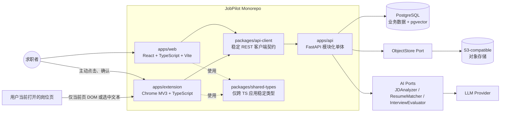
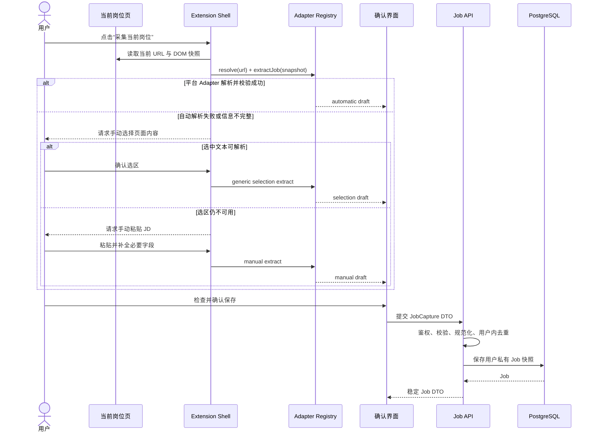
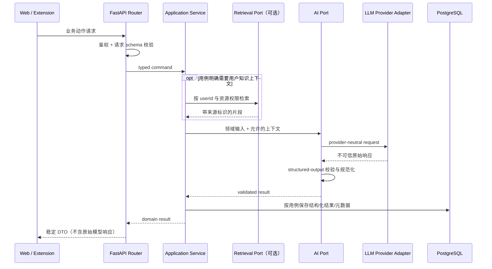

# JobPilot 总体架构

> 文档状态：Phase 0–2A 已批准；Task 6 Web 与 Task 7 Extension 的最小 deterministic Phase 2B authentication slices 已实现并通过 Task 7H 门禁。ADR-007 正在重新评审生产 Identity Provider，Task 8 与 Phase 3 暂停。认证边界见 [AUTH_ARCHITECTURE.md](AUTH_ARCHITECTURE.md)。
>
> 架构风格：Monorepo + Modular Monolith（模块化单体）  
> 核心原则：Simple architecture first；数据库是业务事实来源；外部输入一律在边界校验。

## 1. 目标与范围

JobPilot 是面向求职者的跨招聘平台 AI 求职工作台。招聘平台继续承担岗位发现、HR 沟通和正式投递；JobPilot 只处理用户主动保存后的岗位管理、分析与求职工作流。

当前架构需要支持逐步交付，而不是提前构建完整平台：

- Web、浏览器插件和 API 具有清晰、可测试的职责边界。
- 一个 FastAPI 部署单元承载业务模块，模块之间通过显式服务契约协作。
- Web 与 Extension 使用同一套 REST API，不能各自维护业务事实。
- 招聘网站采集必须由用户触发，且只读取用户当前打开的具体岗位页面。
- AI、RAG、对象存储和招聘网站解析均位于可替换端口之后。
- Phase 0 不实现认证、数据库、插件解析、AI、RAG 或业务页面。

明确不引入微服务、Kafka、Kubernetes、独立向量数据库、复杂 Agent Framework、复杂跨语言代码生成系统或为未来猜测而创建的空模块。

## 2. 关键架构决策与提案

| 决策                 | 结论                                                      | 主要理由                                                                |
| -------------------- | --------------------------------------------------------- | ----------------------------------------------------------------------- |
| 仓库形态             | Monorepo                                                  | Web、Extension、API、契约和文档可以原子演进，便于作品集展示和端到端测试 |
| 后端形态             | Modular Monolith                                          | 当前规模不需要分布式复杂度，同时用模块边界避免“大泥球”                  |
| API 风格             | `/api/v1` 下的 contract-first REST                        | Web 与 Extension 共用稳定契约；DTO 不泄漏 ORM 或供应商结构              |
| 事实来源             | PostgreSQL                                                | 所有持久业务状态由 API 写入数据库；客户端仅保存临时 UI/采集草稿         |
| 向量检索             | PostgreSQL + pgvector                                     | 在早期数据规模内复用同一数据边界和权限模型                              |
| 文件存储             | S3-compatible `ObjectStore` 端口                          | 数据库仅保存对象键和元数据，避免绑定具体云厂商                          |
| AI 集成              | 应用层端口 + Provider Adapter                             | 核心业务不依赖模型厂商、Prompt 或原始 LLM 响应                          |
| 插件采集             | 平台 Adapter Registry + 三级兜底                          | 各平台解析隔离，失败时仍允许用户完成保存                                |
| 认证边界（Accepted） | OIDC；Web opaque HttpOnly session + Extension PKCE bearer | 同一 provider identity 映射本地 User，FastAPI 保持唯一业务授权边界      |
| 生产 IdP（Proposed） | 首选 Self-hosted Logto OSS；Auth0 不再默认批准            | 核心流程必须在中国大陆普通网络、无 VPN/代理条件下通过真实验收           |
| 异步基础设施         | 暂不选型                                                  | 真正出现长任务后再评估同一单体内的后台任务；不提前引入消息系统          |

## 3. 总体架构



所有箭头都代表受控接口。Web 和 Extension 不得直连数据库、对象存储或 LLM；招聘页面也不会被 API 后台访问。

## 4. Monorepo 逻辑布局

以下是目标布局，不要求在 Phase 0 创建对应目录：

```text
jobpilot/
├─ apps/
│  ├─ web/                 # Web UI
│  ├─ extension/           # MV3 外壳、采集编排、平台 adapters
│  └─ api/                 # FastAPI 模块化单体
├─ packages/
│  ├─ shared-types/        # Web/Extension 真正共享且稳定的 TypeScript 类型
│  └─ api-client/          # 两个客户端共用的 REST 调用与错误处理
├─ docs/                   # 产品、架构、契约、数据模型、ADR
├─ tests/                  # 跨应用测试及招聘页面 HTML fixtures
└─ infra/                  # 本地 Docker 与后续部署配置
```

`shared-types` 不承载业务逻辑，也不尝试统一 Python 领域模型。FastAPI 的请求/响应模型是服务端契约边界；TypeScript 侧只维护必要的传输类型与契约测试。若未来手工同步成为可证实的成本，再单独评估基于 OpenAPI 的轻量生成方案。

## 5. 运行时职责

### 5.1 Web

负责：

- 岗位、投递、简历和后续面试/知识库能力的用户界面。
- 表单状态、展示状态、路由和可访问性。
- 通过统一 `api-client` 调用 API，并展示结构化业务错误。

不负责：

- 定义或推导权威业务状态。
- 在 React Component 中实现投递状态机、匹配规则、Prompt 或数据访问逻辑。
- 直接访问 PostgreSQL、对象存储、LLM 或招聘网站。

### 5.2 Extension

当前 Phase 2B authentication 负责：

- Popup 只渲染认证状态并发送 `GET_AUTH_STATE`、`SIGN_IN`、`SIGN_OUT`、`OPEN_WEB_APP` 四个无载荷 intent。
- Trusted service worker 负责 Authorization Code + PKCE、callback/ID-token 验证、双 trusted storage、bearer API、按需 single-flight refresh、direct revoke 与打开经过验证的 Web origin。
- 首次登录通过统一 `api-client` 依次调用 `/api/v1/auth/session` identity establishment 与 `/api/v1/auth/me`；正常重启直接用 `/auth/me` 恢复同一 `UserView`。
- Popup sender 必须同时匹配 runtime Extension ID、精确 popup URL、精确 Extension origin 且没有 `sender.tab`。Popup 与 response schema 都不允许 credential/provider protocol payload。
- 当前没有 content script，也不读取页面、标签页或招聘网站数据。

未来 Phase 3 capture 才负责：

- 在用户主动点击后读取当前活动标签页的 URL 和可见岗位 DOM。
- 调用 Adapter Registry 解析为统一 `JobCaptureDraft`。
- 自动解析失败后提供“手动选择页面内容”和“手动粘贴 JD”两级兜底。
- 展示采集预览，只有用户确认后才通过同一业务 API 保存。

不负责：

- 后台爬取、自动翻页、扫描列表页、绕过验证码/登录或调用隐藏接口。
- 在 content script 内承载业务规则；content script 仅采集页面上下文和传递消息。
- 将本地存储视为岗位或投递状态的事实来源。
- 直接调用 AI、数据库或对象存储。

权限与消息边界：

- 当前 auth-only manifest 只有 `identity`、`storage`，精确 JobPilot API/Auth0 origins，一个 module service worker，以及 `script-src 'self'; object-src 'self'` 的 MV3 CSP。它没有 `activeTab`、`tabs`、content script、招聘网站 host、`<all_urls>`、`unsafe-eval` 或 remote executable script。
- `activeTab` 与用户手势后的按需脚本注入只属于 Phase 3 的候选权限预算；进入该 Phase 后必须重新评审并显式增加，不能把架构预算误写为当前已授予权限。
- 某个平台未来确需持久域权限时，必须作为 optional permission 在使用时请求，并记录用途与撤销方式。
- 当前 Popup/worker boundary 校验无 tab 的精确 Extension sender tuple；未来 content-script capture boundary 还必须验证 `sender.tab`、frame、预期页面来源与消息 schema，不得复用 Popup 信任规则或信任任意页面脚本。
- 用户未点击采集时，后台组件不得读取页面 DOM、遍历标签页或发起招聘平台请求。

### 5.3 API

负责：

- 认证、授权、输入校验、速率与资源边界。
- Job、Application、ResumeVersion 等领域规则和事务。
- PostgreSQL 持久化、幂等/去重策略和审计所需元数据。
- AI、RAG 与对象存储端口的编排及供应商适配。
- 将领域对象映射为稳定 DTO；过滤内部字段和敏感信息。

FastAPI Router 仅处理 `request → validation → application service → response`。它不得保存 Prompt、调用供应商 SDK、跨模块拼 SQL 或直接返回 ORM Model。

## 6. API 模块化单体

首批业务模块为 `identity`、`jobs`、`applications`、`resumes`；`interviews`、`documents`、`evidence` 和 `analytics` 只保留演进边界。AI 与存储是能力端口，不反向拥有业务实体。

源码依赖始终向内，端口由 core（application/domain）拥有，外部 adapter 实现端口并依赖其抽象：

```text
transport/router ---------> application service ---------> domain rules
                                  ^                              ^
                                  | implements owned ports       |
infrastructure adapters ----------+------------------------------+
  (PostgreSQL, LLM, object storage)
```

运行时调用流可以是 `router → service → port → adapter`，但这不改变源码依赖方向：domain/application 不导入具体数据库驱动、LLM SDK 或对象存储 SDK。

约束如下：

- 模块拥有自己的领域规则和持久化访问入口。
- 跨模块协作调用公开的 application service/port，不直接导入对方 repository。
- 事务边界由发起用例的 application service 协调。
- 第三方响应在 infrastructure adapter 处视为不可信数据并校验。
- 只有 API 可以变更持久业务状态；客户端枚举只是 wire contract 的镜像。
- 不建立无业务含义的 `utils.ts`、`helpers.ts`、`common.ts` 汇集层。

## 7. 招聘网站 Adapter 与三级兜底

### 7.1 统一契约

以下是 Extension 内部的概念契约，供 Phase 3 实现前细化，不是当前实现：

```ts
type CaptureInput =
  | { mode: 'automatic'; url: string; page: ReadonlyPageSnapshot }
  | { mode: 'selection'; url: string; selectedText: string }
  | { mode: 'manual'; url?: string; pastedText: string };

type JobSource = 'boss' | 'nowcoder' | 'shixiseng' | 'liepin' | 'iguopin' | 'generic' | 'manual';

interface JobSiteAdapter {
  readonly id: 'boss' | 'nowcoder' | 'shixiseng' | 'liepin' | 'iguopin' | 'generic' | 'manual';
  canHandle(input: CaptureInput): boolean;
  extractJob(input: CaptureInput): Promise<JobCaptureDraft>;
  validate(draft: JobCaptureDraft): CaptureValidation;
}

interface JobCaptureFields {
  source: JobSource;
  sourceJobId?: string;
  title: string;
  company: string;
  salaryText?: string;
  locationText?: string;
  description: string;
  capturedAt: string;
}

type JobCaptureDraft =
  | (JobCaptureFields & {
      captureMethod: 'automatic' | 'selection';
      sourceUrl: string;
    })
  | (JobCaptureFields & {
      captureMethod: 'manual';
      sourceUrl?: string;
    });
```

设计约束：

- `boss`、`nowcoder`、`shixiseng`、`liepin`、`iguopin` 分别拥有独立 adapter 和独立 fixture 测试。
- Adapter 必须是确定性的纯解析边界；它不发起网络请求、不保存数据、不调用 API/LLM。
- Registry 只负责选择 adapter，不包含各平台 CSS 选择器或解析分支。
- `validate` 返回结构化问题（缺失字段、可疑字段和警告），不能用“猜值”掩盖解析失败。
- generic/manual adapter 分别处理当前页选中文本或粘贴内容；selection 必须保留当前页 `sourceUrl`，只有 manual 路径允许没有 URL。
- 任意路径都必须先经过用户预览确认，再提交 API；服务端会再次校验和规范化。

### 7.2 概念目录

Phase 0 只固定未来代码归属，不创建以下空目录：

```text
apps/extension/src/job-capture/
├─ contracts.ts                 # JobCaptureDraft、校验结果与 Adapter 契约
├─ adapter-registry.ts          # 只做 Adapter 注册与选择
└─ adapters/
   ├─ boss/
   ├─ nowcoder/
   ├─ shixiseng/
   ├─ liepin/
   ├─ iguopin/
   ├─ generic/
   └─ manual/

tests/fixtures/job-pages/
├─ boss/
├─ nowcoder/
├─ shixiseng/
├─ liepin/
└─ iguopin/
```

每个平台目录只拥有本平台的识别、提取、校验和 fixture 解释。跨平台契约属于 `job-capture`，不得把选择器或平台分支提升到共享工具模块。

### 7.3 关键采集数据流



用户取消确认时不产生持久数据。失败时应返回可纠正的结构化错误，不静默保存残缺信息。

## 8. AI 边界

### 8.1 端口

API application layer 至少保留三个供应商无关端口：

| Port                 | 输入边界                                                         | 结构化输出                     | 不得承担                                             |
| -------------------- | ---------------------------------------------------------------- | ------------------------------ | ---------------------------------------------------- |
| `JDAnalyzer`         | 已授权的 Job/JD 快照、分析选项                                   | 要求、技能、职责及可追溯依据   | 保存 Job、修改投递状态                               |
| `ResumeMatcher`      | JD 分析结果、指定 ResumeVersion 的版本化提取文本、可选证据上下文 | 匹配维度、缺口、证据引用、建议 | 直接读取不受控文件、生成“可靠录用概率”或直接改写简历 |
| `InterviewEvaluator` | 面试问题、用户回答、评分规则及可选上下文                         | 分项评价、证据、改进建议       | 决定招聘结果或写入未经确认的业务事实                 |

每个端口都使用版本化的输入/输出 schema。ResumeMatcher 依赖 Phase 6 的本地、provider-neutral PDF/DOCX 文本提取结果；提取失败时停止匹配，不把原始文件直接交给某个模型厂商兜底。Provider Adapter 负责 Prompt、模型调用、超时/重试和供应商响应解析；schema 校验通过后，application service 才能接收结果。LLM 原始响应、供应商错误和内部 Prompt 不直接返回客户端。

任何真实 Provider 在 Phase 6 启用前必须通过 AI 数据出站门禁：明确告知用户数据用途；只发送当前用例必要的 JD、指定 ResumeVersion 派生文本和经授权证据；尽可能去除无关身份字段；评审 Provider 的留存、训练使用、区域和删除传播政策；密钥只保存在服务端。不得把对象存储凭据、永久 URL、其他用户数据或未选择的完整知识库发送给 Provider。

### 8.2 AI 数据流



AI 输出默认是辅助判断，不是数据库事实的自动替代。涉及简历内容、证据映射或投递策略的变更，应保留用户确认点。模拟面试后续优先采用显式 workflow/state machine；只有复杂编排需求得到验证后才重新评估 Agent Framework。

## 9. RAG 边界

RAG 是受权限约束的检索能力，不是新的业务数据库。

允许的范围：

- 用户主动上传的简历、作品集和求职资料。
- 用户主动保存的岗位 JD，以及未来经用户确认的面试记录。
- 经过解析、分块、嵌入并带有 `userId`、来源资源 ID、版本和位置信息的片段。
- 检索结果向 AI 提供可追溯引用，最终展示能回到原始资源。

禁止或暂不包含：

- 对招聘网站进行后台抓取或建立自有全站职位库。
- 把任意互联网内容、未确认的插件页面或其他用户数据放入索引。
- 用向量结果覆盖结构化领域事实，或绕过领域服务直接写业务表。
- 在 Phase 0 引入独立向量数据库、知识图谱或复杂 Agent memory。

存储边界：原始文件进入 `ObjectStore`；文档元数据、解析状态、chunk 文本、embedding 和来源定位保存在 PostgreSQL/pgvector。所有写入与查询必须首先以认证用户和资源权限过滤。解析、嵌入、重建索引及保留策略在后续 Phase 单独定义。

Phase 7 实施规格必须在真实启用前给出可测试的处理与检索预算，包括单文件/单用户限制、最大展开页数与 chunk 数、embedding 并发、检索 `topK`、上下文 token 上限和代表性数据集上的延迟目标。长任务优先使用模块化单体内可恢复的后台任务，不因 RAG 预先引入消息系统。

## 10. 对象存储抽象

对象存储仅通过 API 内部 `ObjectStore` port 访问，最低能力边界为：

- 写入对象并返回不透明 `objectKey`。
- 读取/流式下载对象。
- 在授权后生成短时效下载 URL（如确有需要）。
- 删除对象，并以幂等方式处理对象已不存在的情况。

数据库保存 `objectKey`、文件名、MIME、大小、校验和和所有权，不保存永久公网 URL。客户端永远不会获得存储供应商凭证；简历、作品集和未来面试音频默认私有。Key 命名、大小/MIME 白名单、恶意内容检查、生命周期和删除一致性必须在实现对应上传功能前形成专项规格。

## 11. API 与错误边界

- 业务 REST 路径统一置于 `/api/v1`，版本只在发生破坏性契约变化时演进。
- `GET /health` 是不带业务语义、无需版本化的基础设施探针；它不探测数据库、LLM 或招聘平台。
- 请求与响应使用独立 DTO；ORM、数据库列名、对象键和 LLM 原始结果不属于公开契约。
- 错误统一为机器可读 `code`、人类可读 `message`、可选 `details` 和请求追踪 ID。
- 列表端点从首次实现起支持受限分页；外部输入在 Router/Adapter 边界校验。
- Web 与 Extension 经同一 `api-client` 获得一致的认证、错误和重试语义。
- 公开字段优先做向后兼容的增加；删除或改变语义前必须有 ADR 和迁移计划。

端点和 DTO 的具体 Phase 1–4 草案由 `docs/API_CONTRACT.md` 定义，本文件不重复扩展完整 API 面。

## 12. 数据、安全与可观测性约束

- 所有 User、Job、Application、ResumeVersion 及未来资源访问都必须按当前用户授权，不能只依赖客户端传入的 `userId`。
- 招聘页面、粘贴文本、上传文件、LLM 响应和对象存储元数据均为不可信输入。
- 不默认保存完整页面 DOM、Cookie、招聘网站 Token 或非岗位必要的页面信息。
- 日志使用结构化事件和 request/correlation ID；不得记录简历正文、JD 全文、Token 或 LLM 敏感原文。
- AI 调用记录内部可观测元数据（端口、schema/prompt 版本、provider/model、耗时、结果状态），不将供应商细节变成公共 API 契约。
- Sentry 属于后期能力；当前先定义可替换日志边界。

## 13. 测试边界（后续 Phase）

- Adapter：保存的 HTML fixtures 上做纯解析单元/回归测试，不让 CI 访问真实招聘平台。
- API：领域单元测试、PostgreSQL 集成测试和 DTO contract tests。
- Web/Extension：组件测试与少量关键用户流 Browser/E2E；真实平台仅有限人工/DevTools 验证。
- AI/RAG：使用 fake ports 验证业务编排，使用固定样例做 schema、引用和权限隔离测试；默认 CI 不调用真实付费模型。
- ObjectStore：以 contract tests 保证本地与 S3-compatible adapter 语义一致。

## 14. 当前实施边界

Phase 0–2A 已获项目负责人批准，ADR-006 的 provider-neutral Phase 2B contract 已实现。Task 6 Web 与 Task 7 Extension 的 deterministic authentication、User/Identity/session persistence 与统一用户边界已通过 Task 7H 门禁。新增硬约束是 **Core JobPilot workflow must operate without VPN/proxy in Mainland China.** [ADR-007](DECISIONS/ADR-007-mainland-china-identity-provider.md) 处于 Proposed：Self-hosted Logto OSS 是首选候选，但真实部署、协议和大陆网络均未验证；Auth0 不再默认批准。当前不创建或绑定任何真实 provider 资源、不修改认证业务代码。Task 8 与 Phase 3 均暂停并等待单独授权。
