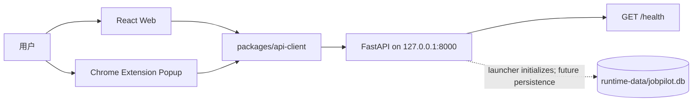

# JobPilot 总体架构

> 状态：ADR-008 与 ADR-009 Accepted。当前为 Phase 2.5 local-first、single-user、no-account、SQLite 基线；Phase 3 尚未开始。

## 1. 架构目标

JobPilot 是运行在用户电脑上的个人求职工作台。架构优先保证：

- 所有 JobPilot 组件只通过精确 loopback 接口协作；
- 已安装核心不依赖远程身份、CDN、telemetry、update 或境外 AI 服务；
- 用户主动打开的招聘页面不经过 JobPilot 后端代理；
- 当前只保留真实使用的 `/health` contract，不预建业务模块；
- 未来业务数据保存在一个本地 SQLite 文件，不需要多用户 ownership 字段。

## 2. 当前运行时



受支持的 launcher 在 Uvicorn 前初始化 SQLite 文件；`GET /health` handler 本身不查询数据库。SQLAlchemy metadata 为空，Alembic 没有业务 revision。

## 3. Monorepo 边界

```text
apps/web                 local workspace Web shell
apps/extension           local health Popup; no background/content script
apps/api                 loopback FastAPI and future local domain services
packages/shared-types    shared health transport type
packages/api-client      validated loopback health client
docs                     canonical product and engineering decisions
```

Web 和 Extension 不直连数据库。未来业务写入统一经过 FastAPI application/domain 边界。

## 4. 组件职责

### 4.1 Web

- 当前状态为 `checking / ready / unavailable`；`unavailable` 提供 retry 动作；
- 只通过 api-client 调用本机 `/health`；
- dev server 固定绑定 `127.0.0.1`；
- 不包含账号、登录、退出、token 或用户资料状态。

### 4.2 Extension

- 当前只有 Popup 和精确 `http://127.0.0.1:8000/*` host permission；
- 没有 `permissions`、background/service worker、content script、storage 或 identity；
- bundle 与 CSP 禁止远程 JavaScript、CDN、telemetry 和代理能力；
- 只向本机 `/health` 发送 credential-free GET。
- Chrome host permission 允许 Popup 直接读取 loopback API；不需要复制 Extension ID，也不把 Extension origin 加入 API CORS。

未来采集必须在独立 Phase 中新增最小权限，不能复用当前 cleanup 作为授权。

### 4.3 API

- 默认监听 `127.0.0.1`，supported launcher 拒绝 `0.0.0.0`、`::`、LAN IP 和 hostname；
- 当前只公开 `GET /health`；
- CORS 只允许精确 loopback Web origin；Extension 访问由 manifest 的精确 host permission 覆盖；
- 不允许 wildcard、regex 或 credentials；
- 保留 request ID、统一错误和 query redaction 基础设施；
- supported launcher 在服务启动前初始化 SQLite；`/health` 不执行数据库查询，也不加载任何远程 client。

## 5. Local persistence

SQLite 是唯一 runtime database；默认文件为 repository root 下的 `runtime-data/jobpilot.db`。SQLAlchemy 2.x 管理 connection/transaction，所有连接启用 foreign keys 与 5000 ms busy timeout。当前保持默认 rollback journal，不启用 WAL。

supported launcher 自动创建父目录与文件并在后续启动复用。Alembic 复用同一 SQLite URL 解析；自动化测试必须传入临时 path，不能创建、替换或删除真实 runtime database。`runtime-data/` 被 Git 忽略，但它是用户数据边界，不是可随意清理的 build artifact。

当前没有 User、Identity、Session、Job、Application、ResumeVersion 或 LocalProfile 表。旧预发布数据库包含已删除 revision 时必须重建，不提供原地迁移。

一个安装实例隐含一个 workspace，因此未来 Job、Application、ResumeVersion 不使用 `user_id`。只有出现真实本机偏好需求时才设计 `LocalProfile`。

## 6. Loopback security

无账号不等于允许远程访问：

- API bind 与客户端 base URL 都强制 loopback；
- CORS 是浏览器读取边界，不是对本机恶意进程的认证；
- 当前 health 是无副作用 GET，使用 `credentials: omit`、`cache: no-store` 和 `redirect: error`；
- 未来第一个写接口必须重新评审 Host、Origin、Fetch Metadata、localhost CSRF 和 DNS rebinding；
- 任何公网、LAN、远程同步或多用户提案必须先新增 ADR 和威胁模型。

## 7. P0 no-proxy runtime

安装后核心不依赖 Auth 服务、公共 CDN、远程字体/脚本、GitHub runtime API/raw、Google/Cloudflare、境外 AI、telemetry 或 update API。开发依赖下载不属于 runtime。

招聘网站访问路径保持：

```text
User browser -> recruitment website
Future user gesture -> exact-host content script -> current rendered DOM
Confirmed data -> loopback API -> local SQLite
```

JobPilot API 不请求招聘网站。每个未来 Adapter 必须：

1. 单独批准精确 host；
2. 由用户主动触发；
3. 只读取当前已打开页面的已呈现 DOM；
4. 禁止后台爬取、自动翻页、隐藏 API 和访问控制绕过；
5. 在关闭 VPN、代理和特殊 DNS 时完成端到端验收。

## 8. Future module boundaries

Phase 3 获批后，首个业务模块才可以是 `jobs`；随后按 Roadmap 增加 `applications` 与 `resumes`。每个模块拥有自己的 domain 规则、application service 和 repository port。Router 只处理 request、validation、service 和 response，不直接承载业务规则或 ORM。

AI、RAG、对象存储和招聘网站 Adapter 都是未来可替换端口，不属于当前 runtime。任何可选远程能力必须显式启用、可降级，并且不能阻塞本地核心。

## 9. 当前门禁

本轮只完成 Phase 2.5 Local Runtime Foundation Finalization。完成 SQLite、重启持久化、真实 Chrome、no-proxy、测试、构建、安全扫描、审查与文档门禁后停止，等待项目负责人决定是否批准 Phase 3。
