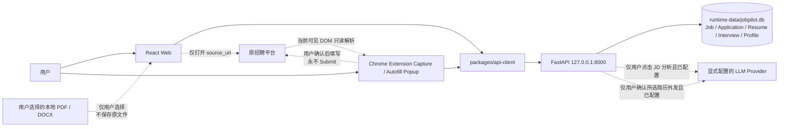

# JobPilot 总体架构

> 状态：ADR-008 至 ADR-016 Accepted。Phase 7 为
> `IMPLEMENTED — SEMANTIC ACCEPTANCE PAUSED`。Phase 8 在同一本地 SQLite 边界增加 Interview
> Record 与请求时计算的事实 Feedback Summary。Phase 9 的 Profile Vault 与安全 Autofill 已完成
> 实现、自动化验证及真实 ATS 人工验收并标记 PASS；Phase 8/9 均不依赖 Provider。
> Phase 10 本地 PDF/DOCX Parse → Preview → Confirm 已完成实现、自动化门禁与虚构文件隔离浏览器
> 验证；真实简历内容和合并验收仍等待项目负责人，尚未标记 PASS。

> Phase 11 AI Job Copilot P0 已完成技术实现；真实 Provider 评测与 BOSS/牛客人工内容验收待完成。

## 1. 运行时



受支持 launcher 在 Uvicorn 前把 SQLite migration 升级到 head。业务请求通过 FastAPI 访问
SQLite；`GET /health` 仍不连接数据库。Web 与 Extension 永不直连 SQLite，API 不访问招聘网站。
Provider 不参与 health、启动、Job/Application/Resume/Interview/Profile CRUD、Feedback Summary、
采集或 Autofill。
JD 分析只接收单个 Job 的批准字段；Evidence Map 只在当次确认后接收当前 requirements 和所选
Resume content。

## 2. Monorepo 边界

```text
apps/web                 岗位库、简历版本、求职资料、投递/面试、事实复盘与可选分析/Evidence 展示
apps/extension           BOSS/牛客采集，以及 Scanner/Resolver/Preview/Safe Fill Popup
apps/api/domain          Job/Application/Resume/Profile/Interview/Feedback/Analysis/Evidence 值与规则
apps/api/application     use-case service、专用 repository port 与 JD/Evidence Provider ports
apps/api/infrastructure  SQLAlchemy/SQLite/Alembic、受限 PDF/DOCX extractor 与一个 AI adapter
apps/api/api             FastAPI schema、router、安全和错误映射
packages/shared-types    camelCase transport 类型与状态中文
packages/api-client      loopback-only、credential-free、响应校验
```

Router 只处理 request、validation、service 与 response。状态流转不写在 Router，ORM 不泄漏到
API 或 Web。业务 repository 保持专用，不建立 generic CRUD/factory。

## 3. Persistence

唯一 runtime database 是 `runtime-data/jobpilot.db`。SQLAlchemy 2.x 管理 transaction，
每个连接启用 foreign keys 和 5000 ms busy timeout；当前单进程继续使用 rollback journal。

Alembic revision `0001_job_application` 创建 `jobs` 和 `applications`；`0002_boss_job_source`
与 `0003_nowcoder_job_source` 只扩展 Job source CHECK；`0004_jd_analysis_records` 增加每 Job
唯一的结构化分析；`0005_resume_versions` 增加纯文本版本及 nullable
`applications.resume_version_id`；`0006_evidence_map_records` 增加每个 Job + Resume Version 的
唯一当前结果与两份输入指纹；`0007_evidence_map_schema_v2` 扩展其 CHECK 以兼容 schema 1/2，
存在 schema 2 记录时拒绝降级；`0008_interview_feedback` 为 Application 增加结果说明/淘汰原因，
并新增 `interview_rounds` 与 `interview_questions`；`0009_autofill_profile` 新增 id 固定为 1 的
`autofill_profiles`，`0010_profile_projects` 增加独立 projects JSON；`0011_copilot_records`
增加 append-only Copilot 历史。Job 删除级联 Application、Interview、Question、JD Analysis、
Evidence 和 Copilot；Round 删除级联 Question。被 Application 引用的 Resume 通过 RESTRICT
和 service guard 保留，未引用 Resume 删除时级联其 Evidence。自动化测试必须显式传入临时数据库
路径。

Phase 10 不新增表：无状态 parse preview 只返回 Web，confirm 在同一 transaction 中按需插入一个
`resume_versions` row 并 patch-like upsert singleton `autofill_profiles`；未选择的 Profile scalar 和
全部既有数组行保持不变。

## 4. API 与 localhost 写入边界

- bind 只接受 IP-literal loopback；客户端 base URL 只接受 loopback；
- CORS 只允许精确配置的 Web origin、无 credentials、无 wildcard/regex；
- 写请求 Host 必须是 loopback；
- 浏览器 cross-site Origin 或 `Sec-Fetch-Site: cross-site` 写入被拒绝；
- Resume Parse 要求一个有界 `Content-Length`，在 multipart/form parsing 前拒绝超过 10 MiB 文件
  加 64 KiB 协议开销的请求；解析后仍对文件内容执行精确 10 MiB 二次校验；
- Manifest 公开公钥把 JobPilot Extension 固定为 `lgchonbleblfegkckndaaandoaekmgjf`；扩展只可
  写入 `POST /api/v1/jobs`，并要求该精确 Origin 与 `Sec-Fetch-Site: none`，且不加入 CORS；
- `GET /api/v1/autofill-profile` 对同一精确 Extension Origin 开放只读，并继续要求 loopback Host
  与 `Sec-Fetch-Site: none`；Profile PUT 只允许现有精确 Web origins；
- POST/PUT/PATCH 只接受 `application/json`；
- SQLite locked/busy 映射为不泄漏内部信息的 `503 DATABASE_BUSY`；
- request ID 与统一错误信封覆盖 validation、domain 和 framework error。

CORS/Host 不是对同一操作系统账户下恶意进程的认证。若以后允许 LAN/public/multi-user，
必须先有新 ADR 与威胁模型。

## 5. Web architecture

Web 不引入路由或状态框架。App 只协调 health 和 library/create/resumes/profile/detail/feedback 视图；
岗位库、表单、简历版本、求职资料、详情、Application、Interview、Feedback、JDAnalysisPanel、
EvidenceMapPanel 与 CopilotPanel 为聚焦组件。所有业务 I/O 经过 api-client，不自行拼 HTTP。Interview UI 只记录
用户输入的本地事实且不改变 Application；Feedback UI 只呈现 API 的确定性统计。Evidence Map 按
六类条件呈现逐项明确结论、判断依据和原文证据，并在 Web 端确定性计算全图计数、待确认项与主要
证据缺口。JD 分析请求使用 35 秒 client timeout，Evidence Map 与 Copilot 生成使用 65 秒 client
timeout，其余核心请求保持 5 秒。

“去原平台查看/投递”使用 `target="_blank"` 与 `rel="noreferrer"`，没有关联 mutation。

## 6. Optional AI boundary

调用链固定为 Web → FastAPI → JDAnalysisService/EvidenceMapService/CopilotService → 对应小型
Provider port。同一个 OpenAI-compatible infrastructure adapter 实现三项职责，使用标准库 HTTP、60 秒 timeout、
禁用代理继承，不引入 SDK、factory、registry、LangChain 或 Agent。可选配置只来自 FastAPI
进程环境；三项缺失/非法时服务仍启动并向 Web 返回未配置状态。

Copilot 复用同一 adapter，通过独立 `CopilotService` 与三份小型 Prompt 生成 Match、
Resume Advice 和 Interview Prep。输入只含当前结构化岗位条件、明确选择的一个 Resume，或该
Job 已有 Interview 记录；phone/email 在 Provider data 构造前删除。所有 source type/id/quote
经 domain parser 验证后才 append-only 写入 `copilot_records`。输入指纹变化只在读取时标 stale；
重新生成失败不覆盖历史结果。Copilot 不修改 Job、Resume、Application 或 Interview。

JD 服务仅构造 title/company/description/location/salaryText 输入。Evidence 服务只构造必要岗位
上下文、当前非 stale 的硬性要求、加分项、职责、技能、经验、学历六类条件与用户当次确认的一个
Resume content；摘要、领域关键词和面试重点不属于匹配条件。
系统提示与不可信 JD/Resume JSON 分离。Provider content 经过 parse、strict schema、normalize、
requirement identity/order check 与 Resume quote exact-substring check 后才 upsert；无有效 quote 的
DIRECT/PARTIAL 降级 GAP。Evidence Prompt 先理解 requirement，再扫描完整 Resume；可从不同
section 组合一至三条 grounded quotes 做语义判断，但不得通过外部常识补全任何用户事实或从入学
时间推导未写出的毕业年份。Key、provider envelope、raw malformed response、原始招聘页 HTML、
完整 JD、notes、Application、其他 Job/Resume 和本地文件不跨越 Evidence 边界。

## 7. Interview 与 Feedback boundary

`InterviewService` 通过专用 repository 管理 Application 下的轮次与问题。列表一次返回每轮及其
问题，避免 Web 逐轮查询；创建、编辑、完成、取消或删除面试都不会调用 Application 状态机。
Application 的 `outcomeNote`/`rejectionReason` 仍通过现有 Application service 显式更新，淘汰原因
离开 `rejected` 状态时清空。

`FeedbackSummaryService` 只组合 repository 返回的 aggregate facts。Repository 使用有界聚合查询
计算 totals、不同 Application 的面试参与、题目分类、自评、淘汰原因、来源和简历版本分组；
domain 层确定性生成 funnel 和弱项排序。结果不持久化、不调用 Provider、不读取简历正文，也不
产生评分、建议或因果推断。转化率在分母为零或后续事实计数大于前序计数时为 null。

## 8. Profile 与 Autofill boundary

Web 通过 api-client 的 GET/PUT 管理一个 `AutofillProfile`；API domain 负责长度、`YYYY-MM`、
HTTP(S) URL、非空条目和教育/工作/项目各最多 20 条验证，repository 只操作 singleton row。
Profile 与 Resume/Application 没有关联或隐式状态更新；只有 Phase 10 Confirm 可按用户选择追加
导入资料。Extension Resolver/Executor 不消费或填写 projects。

Popup 打开时不读页面或 Profile。用户点击 Scan 后，Extension 并行读取精确 loopback Profile 并
通过 `activeTab` 一次性注入自包含 Scanner。Resolver 在 Extension 内使用有限规则创建临时
Fill Plan；Preview 默认只选择 READY，REVIEW_REQUIRED 由用户另行勾选。Fill 时再次查询当前 tab，
并由自包含 Executor 核对 URL/ref/signature 后使用原生 setter 与标准事件。选项不唯一、字段失效、
敏感/只读/文件/勾选控件均失败关闭。所有 Profile/Fill Plan 只在 Popup 内存，未进入 Extension
storage；没有常驻 content script、后台、招聘 host permission、LLM、remote parser 或 telemetry。

Scan、Fill、Submit 是三个独立动作。Executor 不包含任何 submit/requestSubmit/Submit/Continue
调用，也不创建或更新 Application；最终提交始终由用户在招聘页面执行。

## 9. Resume Import boundary

Web 用户主动选择一个文件后，通过 api-client 把最多 10 MiB 的 multipart 只发往 loopback Parse
endpoint。API 在内存中验证 extension/MIME/magic，PDF 与 DOCX extractor 分别执行页数、文本、
ZIP/XML 等资源安全检查，再把按序 block 交给无 LLM 的 deterministic structure parser。文件名和
正文不写日志，原始文件不落库、不保留；Extension 不参与。

Web 只用 text node/textarea 展示 preview，并加载当前 Profile 做 Current vs Imported 选择。明确
PROJECT section 可产生独立、可编辑、可勾选和可查重的 projects candidates。Confirm 只接收用户
选择的 scalar updates 和 row additions；repository 在一个 transaction 中重新读取当前
Profile，再创建可选 Resume Version 与更新 Profile。Parse、Preview、取消均不修改 SQLite。

## 10. Local-first 与后续边界

installed core runtime 不依赖远程身份、CDN、字体/脚本、telemetry、update、对象存储或 AI。
Extension 只使用 `activeTab` 与 `scripting`；没有 background、常驻 content script、`tabs`
permission 或招聘网站 host permission。当前 tab 通过一个显式 BOSS/牛客条件分派进入对应
Adapter；两个一次性 parser 都只能在明确用户手势后读取当前已呈现的必要 DOM 纯文本，随后
由用户确认并通过共享 api-client 调用现有 Job service。

Autofill 使用同一 `activeTab` 做另一次用户触发的一次性注入，但不复用或扩展 BOSS/牛客
Adapter：generic Scanner 生成有界字段描述，Safe Fill 只写 Preview 已确认的字段。两条入口在
Popup 中并列，互不自动触发，也不增加平台专用权限。

两个 Adapter 共享 `JobCaptureDraft/JobCaptureResult`、Popup 状态/编辑/保存/duplicate 流程与
source labels。平台检测、selectors、页面结构和可见文本 helper 保留在各 Adapter 内，因为
`chrome.scripting.executeScript` 注入函数必须自包含；此时抽取 DOM helper 会引入更复杂的 runner、
配置或 factory，不能降低整体复杂度。

真实 BOSS 与牛客的 Extension、解析、保存和 Web 链路必须分别通过 no-proxy 验收，不得改变
Phase 3 的本地事实边界或 Application 状态。
