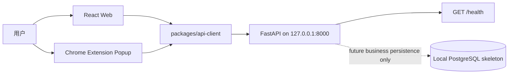

# JobPilot 总体架构

> 状态：ADR-008 Accepted。当前为 local-first、single-user、no-account 基线；Phase 3 尚未开始。

## 1. 架构目标

JobPilot 是运行在用户电脑上的个人求职工作台。架构优先保证：

- 所有 JobPilot 组件只通过精确 loopback 接口协作；
- 已安装核心不依赖远程身份、CDN、telemetry、update 或境外 AI 服务；
- 用户主动打开的招聘页面不经过 JobPilot 后端代理；
- 当前只保留真实使用的 `/health` contract，不预建业务模块；
- 未来业务数据保存在本地 PostgreSQL，不需要多用户 ownership 字段。

## 2. 当前运行时



当前 `/health` 启动不创建 database engine，也不连接 PostgreSQL。SQLAlchemy metadata 为空，Alembic 没有业务 revision。

## 3. Monorepo 边界

```text
apps/web                 local workspace Web shell
apps/extension           local health Popup; no background/content script
apps/api                 loopback FastAPI and future local domain services
packages/shared-types    shared health transport type
packages/api-client      validated loopback health client
docs                     canonical product and engineering decisions
```

Web 和 Extension 不直连数据库。未来业务写入统一经过 FastAPI application/domain 边界。

## 4. 组件职责

### 4.1 Web

- 当前状态为 `checking / ready / unavailable`；`unavailable` 提供 retry 动作；
- 只通过 api-client 调用本机 `/health`；
- dev server 固定绑定 `127.0.0.1`；
- 不包含账号、登录、退出、token 或用户资料状态。

### 4.2 Extension

- 当前只有 Popup 和精确 `http://127.0.0.1:8000/*` host permission；
- 没有 `permissions`、background/service worker、content script、storage 或 identity；
- bundle 与 CSP 禁止远程 JavaScript、CDN、telemetry 和代理能力；
- 只向本机 `/health` 发送 credential-free GET。

未来采集必须在独立 Phase 中新增最小权限，不能复用当前 cleanup 作为授权。

### 4.3 API

- 默认监听 `127.0.0.1`，supported launcher 拒绝 `0.0.0.0`、`::`、LAN IP 和 hostname；
- 当前只公开 `GET /health`；
- CORS 只允许精确 loopback Web origin 和明确配置的 Chrome Extension ID；
- 不允许 wildcard、regex 或 credentials；
- 保留 request ID、统一错误和 query redaction 基础设施；
- 当前不加载数据库或任何远程 client。

## 5. Local persistence

PostgreSQL、SQLAlchemy 和 Alembic 作为未来本地业务持久化骨架保留。数据库 URL 只允许 loopback PostgreSQL；远端 host 被拒绝。

当前没有 User、Identity、Session、Job、Application、ResumeVersion 或 LocalProfile 表。旧预发布数据库包含已删除 revision 时必须重建，不提供原地迁移。

一个安装实例隐含一个 workspace，因此未来 Job、Application、ResumeVersion 不使用 `user_id`。只有出现真实本机偏好需求时才设计 `LocalProfile`。

## 6. Loopback security

无账号不等于允许远程访问：

- API bind 与客户端 base URL 都强制 loopback；
- CORS 是浏览器读取边界，不是对本机恶意进程的认证；
- 当前 health 是无副作用 GET，使用 `credentials: omit`、`cache: no-store` 和 `redirect: error`；
- 未来第一个写接口必须重新评审 Host、Origin、Fetch Metadata、localhost CSRF 和 DNS rebinding；
- 任何公网、LAN、远程同步或多用户提案必须先新增 ADR 和威胁模型。

## 7. P0 no-proxy runtime

安装后核心不依赖 Auth 服务、公共 CDN、远程字体/脚本、GitHub runtime API/raw、Google/Cloudflare、境外 AI、telemetry 或 update API。开发依赖下载不属于 runtime。

招聘网站访问路径保持：

```text
User browser -> recruitment website
Future user gesture -> exact-host content script -> current rendered DOM
Confirmed data -> loopback API -> local PostgreSQL
```

JobPilot API 不请求招聘网站。每个未来 Adapter 必须：

1. 单独批准精确 host；
2. 由用户主动触发；
3. 只读取当前已打开页面的已呈现 DOM；
4. 禁止后台爬取、自动翻页、隐藏 API 和访问控制绕过；
5. 在关闭 VPN、代理和特殊 DNS 时完成端到端验收。

## 8. Future module boundaries

Phase 3 获批后，首个业务模块才可以是 `jobs`；随后按 Roadmap 增加 `applications` 与 `resumes`。每个模块拥有自己的 domain 规则、application service 和 repository port。Router 只处理 request、validation、service 和 response，不直接承载业务规则或 ORM。

AI、RAG、对象存储和招聘网站 Adapter 都是未来可替换端口，不属于当前 runtime。任何可选远程能力必须显式启用、可降级，并且不能阻塞本地核心。

## 9. 当前门禁

本轮只完成 Authentication & Repository Simplification 的文档和仓库清理。完成测试、构建、link、stale-reference、remote-runtime 和 tracked-artifact 检查后停止，等待项目负责人决定是否批准 Phase 3。
