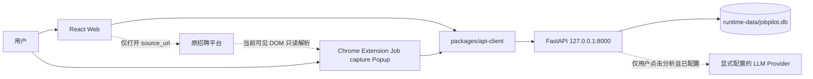

# JobPilot 总体架构

> 状态：ADR-008 至 ADR-013 Accepted。Phase 6 增加可选 Provider seam，同时保持 local-first、
> single-user、no-account、SQLite 核心。

## 1. 运行时



受支持 launcher 在 Uvicorn 前把 SQLite migration 升级到 head。业务请求通过 FastAPI 访问
SQLite；`GET /health` 仍不连接数据库。Web 与 Extension 永不直连 SQLite，API 不访问招聘网站。
Provider 不参与 health、启动、Job/Application 或采集，只接收单个 Job 的批准字段。

## 2. Monorepo 边界

```text
apps/web                 岗位库、手动录入、详情、投递跟踪与可选分析展示
apps/extension           BOSS/牛客页面分派、一次性只读 Adapter、确认编辑 Popup
apps/api/domain          Job/Application/Analysis 值、schema 与校验规则
apps/api/application     use-case service、repository port 与单一 Provider port
apps/api/infrastructure  SQLAlchemy/SQLite/Alembic 与一个 OpenAI-compatible adapter
apps/api/api             FastAPI schema、router、安全和错误映射
packages/shared-types    camelCase transport 类型与状态中文
packages/api-client      loopback-only、credential-free、响应校验
```

Router 只处理 request、validation、service 与 response。状态流转不写在 Router，ORM 不泄漏到
API 或 Web。三个业务 repository 保持专用，不建立 generic CRUD/factory。

## 3. Persistence

唯一 runtime database 是 `runtime-data/jobpilot.db`。SQLAlchemy 2.x 管理 transaction，
每个连接启用 foreign keys 和 5000 ms busy timeout；当前单进程继续使用 rollback journal。

Alembic revision `0001_job_application` 创建 `jobs` 和 `applications`；`0002_boss_job_source`
与 `0003_nowcoder_job_source` 只扩展 Job source CHECK；`0004_jd_analysis_records` 增加每 Job
唯一的结构化 JSON、schema version、输入指纹与时间。Application 和分析均在 Job 删除时级联。
自动化测试必须显式传入临时数据库路径。

## 4. API 与 localhost 写入边界

- bind 只接受 IP-literal loopback；客户端 base URL 只接受 loopback；
- CORS 只允许精确配置的 Web origin、无 credentials、无 wildcard/regex；
- 写请求 Host 必须是 loopback；
- 浏览器 cross-site Origin 或 `Sec-Fetch-Site: cross-site` 写入被拒绝；
- Manifest 公开公钥把 JobPilot Extension 固定为 `lgchonbleblfegkckndaaandoaekmgjf`；扩展只可
  写入 `POST /api/v1/jobs`，并要求该精确 Origin 与 `Sec-Fetch-Site: none`，且不加入 CORS；
- POST/PATCH 只接受 `application/json`；
- SQLite locked/busy 映射为不泄漏内部信息的 `503 DATABASE_BUSY`；
- request ID 与统一错误信封覆盖 validation、domain 和 framework error。

CORS/Host 不是对同一操作系统账户下恶意进程的认证。若以后允许 LAN/public/multi-user，
必须先有新 ADR 与威胁模型。

## 5. Web architecture

Web 不引入路由或状态框架。App 只协调 health 和 library/create/detail 三种视图；岗位库、
表单、详情、Application 和 JDAnalysisPanel 为聚焦组件。所有业务 I/O 经过 api-client，不自行拼
HTTP。分析请求使用 35 秒 client timeout，其余核心请求保持 5 秒。

“去原平台查看/投递”使用 `target="_blank"` 与 `rel="noreferrer"`，没有关联 mutation。

## 6. Optional AI boundary

调用链固定为 Web → FastAPI → JDAnalysisService → JDAnalysisProvider。只有一个
OpenAI-compatible infrastructure adapter，使用标准库 HTTP、60 秒 timeout、禁用代理继承，
不引入 SDK、factory、registry、LangChain 或 Agent。可选配置只来自 FastAPI 进程环境；三项
缺失/非法时服务仍启动并向 Web 返回未配置状态。

服务仅构造 title/company/description/location/salaryText 输入。系统提示与不可信 JD JSON 分离。
Provider content 经过 parse、strict schema、normalize、evidence exact-substring check 后才 upsert。
Key、provider envelope、raw malformed response、notes、Application 和其他 Job 不跨越此边界。

## 7. Local-first 与后续边界

installed core runtime 不依赖远程身份、CDN、字体/脚本、telemetry、update、对象存储或 AI。
Extension 只使用 `activeTab` 与 `scripting`；没有 background、常驻 content script、`tabs`
permission 或招聘网站 host permission。当前 tab 通过一个显式 BOSS/牛客条件分派进入对应
Adapter；两个一次性 parser 都只能在明确用户手势后读取当前已呈现的必要 DOM 纯文本，随后
由用户确认并通过共享 api-client 调用现有 Job service。

两个 Adapter 共享 `JobCaptureDraft/JobCaptureResult`、Popup 状态/编辑/保存/duplicate 流程与
source labels。平台检测、selectors、页面结构和可见文本 helper 保留在各 Adapter 内，因为
`chrome.scripting.executeScript` 注入函数必须自包含；此时抽取 DOM helper 会引入更复杂的 runner、
配置或 factory，不能降低整体复杂度。

真实 BOSS 与牛客的 Extension、解析、保存和 Web 链路必须分别通过 no-proxy 验收，不得改变
Phase 3 的本地事实边界或 Application 状态。
