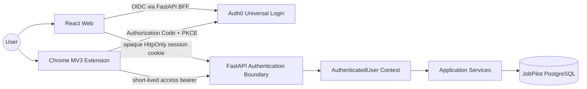

# JobPilot Authentication Architecture

> **Status**：Phase 2A Accepted architecture; the deterministic Task 6 Web server-backed session slice is implemented, while Task 7 Extension PKCE and real provider configuration remain pending.
>
> **Decision record**：[ADR-006](DECISIONS/ADR-006-authentication-strategy.md)
>
> **Implementation gate**：Satisfied for Task 6 code, tests, Web session schema, API and browser UI. Real Auth0 tenant/application values must still be supplied and approved by the project owner; no live provider verification is claimed.

## 1. Scope

This document defines how the Web app, Chrome Extension, and FastAPI share one user identity while using transports appropriate to each runtime. It is both the accepted Phase 2B boundary and the implementation contract: Task 6 now implements the Web/BFF/session portions, while the Extension client lifecycle remains design-only until Task 7.

V1 uses Auth0 as a managed OIDC identity provider. Auth0 owns credentials, email verification, recovery, hosted login, upstream OAuth connections, and provider refresh grants. JobPilot owns its local User, Web sessions, business authorization, account deletion orchestration, PostgreSQL data, and all future private objects. JobPilot-controlled retention limits do not claim control over Auth0's own logs/backups or legally required records; those provider-side terms must be reviewed and disclosed at the Phase 2B entry gate.

The design deliberately does not include organizations, teams, roles, administrator matrices, enterprise SSO, a custom password database, or a JobPilot OAuth server.

## 2. Architecture Summary



The two clients do not share browser storage or copy credentials between origins. They share one verified provider identity and one local `User.id`.

## 3. Identity Model

### 3.1 Provider identity and local User

The stable mapping is:

```text
(identity_issuer, identity_subject) -> JobPilot User.id
```

- `identity_issuer` is the exact configured OIDC issuer URL for the environment.
- `identity_subject` is the provider `sub`, treated as an opaque case-sensitive string.
- `User.id` is a JobPilot-generated stable UUID and is the only user foreign key used by business tables.
- `email` is a verified, mutable profile/contact attribute. It is not used as the authentication key and never auto-links two provider identities.
- `display_name`, `locale`, and `time_zone` are local product profile fields, not OIDC authorization claims.

Phase 2B must confirm that Auth0 emits a stable `sub` across the Web and Extension clients in the same tenant/connection. A valid identity without a verified email cannot activate a JobPilot account or access business resources.

Claim sources are explicit: the Web callback validates the signed OIDC ID token and its standard `email`/`email_verified` claims; the Extension API access token must contain Phase 2B-configured, collision-resistant namespaced email and email-verification claims emitted by a reviewed Auth0 Action. FastAPI never assumes that a custom-API access token contains standard profile claims by default. Missing, unverified, or malformed claims fail provisioning.

JobPilot stores no password, password hash, social-provider access token, security answer, or recovery code in `User`.

### 3.2 Local provisioning

After a successful provider flow, cryptographic validation produces a `VerifiedProviderIdentity`. An identity application service idempotently resolves it:

1. Existing mapping: load the same local User and synchronize only approved mutable claims such as verified email.
2. No mapping: create the minimal local User after verification and explicit account creation/login completion. `display_name`, `locale`, and `time_zone` remain null until the authenticated user sets them through `PATCH /api/v1/auth/me`; provisioning never guesses them from untrusted client hints.
3. Same email with a different `(issuer, subject)`: stop and require an explicit future account-linking flow; never merge automatically.
4. Existing `deletion_pending` mapping: deny provisioning and continue deletion/recovery rather than restoring access. After provider acknowledgement and completed hard deletion, no identity tombstone is kept: a later explicit hosted authentication/account-creation flow may create a **fresh** local `User.id`, but no old data, ownership, session, or mapping is restored. V1's restore marker is keyed to the deleted `User.id`; it prevents backup resurrection, not future re-registration.

Only the Web callback and `POST /api/v1/auth/session` may use `VerifiedProviderIdentity` to provision. Normal business endpoints require an already active local User. Provisioning logic does not live in React, popup code, FastAPI routers, or generic JWT middleware.

### 3.3 Provider identity and authenticated user contexts

Provider validation first constructs a deliberately non-authorizing context:

```text
VerifiedProviderIdentity
- identity_issuer
- identity_subject
- verified_email
- authorized_party
- authentication_time (when supplied and validated)
```

This context can establish a JobPilot session/User only at the two provisioning boundaries above. It cannot read or mutate a business resource.

After mapping to an active local User, FastAPI constructs the immutable context used by application services:

```text
AuthenticatedUser
- user_id          # local JobPilot User.id
- identity_issuer  # audit/security boundary
- identity_subject # audit/security boundary
- session_kind     # web | extension
- session_id       # internal correlation/revocation identifier when available
```

Provider roles, arbitrary metadata, email, and client-supplied `userId` do not grant business permissions.

## 4. Web Authentication Flow

```mermaid
sequenceDiagram
    actor User
    participant Web as React Web
    participant API as FastAPI BFF
    participant IdP as Auth0 Universal Login
    participant Sessions as Server Session Store
    participant DB as JobPilot User Store

    User->>Web: Choose sign in or create account
    Web->>API: GET /api/v1/auth/web/authorize
    API->>API: Create one-time state, nonce, PKCE transaction and hash-bound browser handle
    API-->>User: Set short HttpOnly transaction cookie; 302 to exact Auth0 authorize URL
    User->>IdP: Authenticate / verify email
    IdP-->>API: Authorization code + state
    API->>API: Verify state + transaction cookie; exchange code; validate issuer, nonce and claims
    API->>DB: Resolve or create local User by issuer + subject
    API->>Sessions: Create/rotate revocable server-side session
    API-->>User: Delete transaction cookie; set opaque session cookie; 303 to allowlisted Web path
    User->>Web: Load application
    Web->>API: GET /api/v1/auth/me with cookie
    API->>Sessions: Validate hash, expiry, revocation and User state
    API-->>Web: UserView
    Web->>API: GET /api/v1/auth/csrf with cookie
    API-->>Web: Session-bound CSRF value (no-store)
```

### 4.1 Web credential transport

The browser receives only an opaque, high-entropy session identifier. The production cookie is host-only and uses:

```text
__Host-jobpilot_session
HttpOnly; Secure; SameSite=Lax; Path=/; no Domain
```

Only a hash of the identifier is stored server-side. The Task 6 session record contains the local `user_id`, provider identity, opaque session/CSRF hashes, creation/last-use/idle/absolute-expiry times, and revocation state. Web requests only `openid profile email`; the callback discards the ID/access token after validation and stores no provider refresh token or grant material.

Before that session exists, `/auth/web/authorize` sets a different one-time cookie containing only a random transaction handle. In production it is `__Host-jobpilot_login_tx` with `HttpOnly; Secure; SameSite=Lax; Path=/; no Domain; Max-Age=600`; the Lax setting permits the top-level OIDC callback while preventing cross-site subrequest use. The server-side record expires no later than the same 10-minute limit. Callback requires both matching `state` and this browser-bound handle; success, denial, expiry, mismatch, or provider error always deletes the cookie with the exact attributes used to create it and invalidates the transaction. A callback URL copied to another browser therefore cannot establish the attacker's session for the victim.

Task 6 implements `intent=login|signup`. Login uses `prompt=login`, so a local JobPilot logout cannot be silently undone by a surviving Auth0 SSO cookie; signup is only a Universal Login hint. Recent reauthentication and revoke-all require a separately frozen session-binding contract and are deferred rather than partially implemented.

Initial targets are a 7-day idle timeout and 30-day absolute lifetime. The identifier rotates after login and security-sensitive renewal; logout/revoke marks the server record invalid before clearing the cookie.

React never receives a bearer or refresh token. A bearer in `localStorage`, IndexedDB, a readable cookie, URL, Redux/state store, or build-time configuration is forbidden.

### 4.2 XSS, CSRF, CORS, and SameSite

- HttpOnly limits direct credential exfiltration by XSS, but malicious same-origin JavaScript can still act as the user. Output encoding, no unsafe HTML rendering, CSP, dependency review, and input validation remain required.
- After login, React fetches a session-bound synchronizer value from `GET /api/v1/auth/csrf`, keeps it only in memory, and returns it in `X-CSRF-Token`. The endpoint is Web-session-only, exact-CORS protected, and `Cache-Control: no-store`.
- Every cookie-authenticated `POST`, `PATCH`, `PUT`, and `DELETE` request requires that CSRF value, exact `Origin` validation, and compatible Fetch Metadata checks.
- `SameSite=Lax` supports the top-level OIDC callback while reducing cross-site cookie sending. It is defense in depth, not the only CSRF control.
- `returnTo` accepts only an allowlisted relative Web path. Arbitrary redirect URLs are rejected.
- Production Web and API origins must be **schemeful same-site** so the `SameSite=Lax` session cookie is sent on API fetches; they may be cross-origin only with an exact Web-origin CORS allowlist and credentials. Wildcard/reflected origins are forbidden. A cross-site deployment requires reopening this ADR rather than silently changing the cookie to `SameSite=None`.
- Production static hosting must rewrite `/auth/error` to the Web SPA entry and set a reviewed CSP plus security response headers at the deployment boundary. Task 6 deliberately does not add a permissive meta CSP or guess a hosting-provider configuration.

## 5. Extension Authentication Flow

```mermaid
sequenceDiagram
    actor User
    participant Popup as Extension Popup
    participant Worker as Trusted Service Worker
    participant Chrome as chrome.identity
    participant IdP as Auth0 Authorization Server
    participant API as FastAPI

    User->>Popup: Choose sign in
    Popup->>Worker: Typed SIGN_IN intent
    Worker->>Worker: Generate state, nonce and PKCE verifier/challenge
    Worker->>Chrome: launchWebAuthFlow(exact authorize URL)
    Chrome->>IdP: Authorization request + PKCE challenge
    User->>IdP: Authenticate / consent
    IdP-->>Chrome: Redirect to exact chromiumapp callback with code + state
    Chrome-->>Worker: Final callback URL
    Worker->>Worker: Verify state; reject missing/duplicate/expired transaction
    Worker->>IdP: Exchange code + verifier (public client, no secret)
    IdP-->>Worker: Signed ID token + short API access token + rotating refresh token
    Worker->>Worker: OIDC client validates ID token iss/aud/signature/nonce, then discards it
    Worker->>Worker: Validate response; persist versioned refresh record, then volatile access token
    Worker->>API: Establish/read session with Authorization: Bearer access token
    API->>API: Validate JWT and resolve issuer + subject to User.id
    API-->>Worker: UserView
    Worker-->>Popup: Signed-in profile state only; no token
```

### 5.1 Credential acquisition

- Login starts only after a user gesture.
- The Extension uses a separate Auth0 public client with Authorization Code + PKCE S256. It has no client secret.
- `state` prevents login CSRF, `nonce` binds the identity response, and the PKCE verifier binds the intercepted code to the initiating Extension.
- Redirect URIs are generated from `chrome.identity.getRedirectURL()` and allowlisted exactly for each stable dev/prod Extension ID. Wildcards and caller-supplied redirects are forbidden.
- The trusted OIDC client/SDK validates the signed ID token's issuer, client audience, signature, times, and exact nonce, then discards it. The API accepts only the separate access token whose audience is the JobPilot API; an ID token is never accepted as an API bearer.
- Direct code exchange, refresh, and revoke fetches require an exact Auth0 tenant origin in `host_permissions`, separate from the exact JobPilot API permission. No wildcard Auth0 or general HTTPS permission is allowed.
- The access token used for first establishment carries reviewed, namespaced verified-email claims; it never relies on Auth0 adding standard email claims to a custom API token by default.
- Extension API fetches use `credentials: omit` and explicitly attach the access bearer. CORS allowlists the stable `chrome-extension://<id>` origin and required headers; it never authorizes arbitrary extension IDs.

### 5.2 Credential storage

| Credential/state              | Location                                          | Rule                                                                                                |
| ----------------------------- | ------------------------------------------------- | --------------------------------------------------------------------------------------------------- |
| PKCE verifier, state, nonce   | trusted worker memory or `chrome.storage.session` | One login transaction; delete on success, cancel, timeout, or error                                 |
| Access token                  | worker memory or `chrome.storage.session`         | Target 5–10 minute lifetime; never persist to disk when avoidable                                   |
| Rotating refresh token record | `chrome.storage.local`                            | Set access level to `TRUSTED_CONTEXTS`; store one versioned `ready` or `refresh_in_progress` record |
| Display profile               | popup state / non-sensitive storage               | Contains no credential or provider secret                                                           |

Before reading or writing any secret, the worker must successfully apply `chrome.storage.local.setAccessLevel({accessLevel: "TRUSTED_CONTEXTS"})`; failure is fail-closed and no token exchange/refresh proceeds. `chrome.storage.sync`, Web `localStorage`, IndexedDB, source code, popup DOM, content scripts, recruitment pages, messages to page scripts, telemetry, and logs are forbidden credential locations.

`chrome.storage.local` is not a hardware vault. Its accepted V1 boundary is the signed-in OS/browser profile plus the Extension's trusted contexts. Device compromise or a malicious Extension update can still steal it; short access lifetime, rotating refresh, replay detection, revocation, minimal permissions, MV3 CSP, and release integrity reduce the impact.

### 5.3 MV3 lifecycle

The service worker is disposable. It does not use timers, hidden pages, or keepalive tricks to remain active. A single-flight promise only coalesces callers during the lifetime of the **current worker**; it is not a cross-restart lock. Chrome's two storage areas and the provider's rotation cannot form one atomic transaction, so V1 uses a fail-closed, crash-consistent protocol:

1. use a still-valid access token from trusted session storage;
2. before sending a refresh, replace the persisted refresh record with `refresh_in_progress` (generation/start time, no reusable old token) while holding the old token only in worker memory;
3. send that old token once through the current worker's single-flight request;
4. after a valid rotation response, persist one versioned `ready` record containing the new refresh token in `chrome.storage.local`; only after that write is acknowledged may the worker write the access token to `chrome.storage.session` and release callers;
5. if the worker stops, the network outcome is ambiguous, a storage write is unacknowledged, or startup finds `refresh_in_progress`, never replay the old refresh token. Clear trusted token state and require interactive login;
6. if provider reuse/rejection is explicit, clear the token family, emit a credential-free security event, and require interactive login.

The initial code exchange follows the same ordering: persist the new `ready` refresh record before the volatile access token. Losing availability and asking the user to sign in again is preferred to replaying a possibly rotated token and revoking the whole family.

The popup never performs token refresh itself. Content scripts can send validated job-capture messages later, but cannot read authentication storage or attach credentials.

## 6. FastAPI Authentication Boundary

FastAPI separates provider proof from local business authentication. Provider proof yields `VerifiedProviderIdentity`; mapping an active local User yields `AuthenticatedUser`. The two transport adapters converge only at the latter boundary for normal application services:

### 6.1 Web cookie adapter

1. Read the named host-only cookie; never accept it from query/body.
2. Hash the presented identifier and find an active server-side session.
3. Enforce idle/absolute expiry, revocation, expected session kind, and account state.
4. Rotate or refresh only through the dedicated session service.
5. Resolve local `User.id` and create `AuthenticatedUser`.

### 6.2 Extension bearer adapter

1. Require `Authorization: Bearer <access-token>`; reject query, fragment, cookie fallback, ID tokens, and malformed schemes.
2. Use an explicit algorithm allowlist; reject `none`, algorithm confusion, unexpected issuer or audience.
3. Validate signature against cached JWKS plus `iss`, `aud`, token type, allowed `azp`/client ID, `exp`, `nbf`, `iat`, and non-empty `sub`, with a small fixed clock-skew allowance.
4. Resolve keys only from the configured issuer's fixed HTTPS JWKS URI. An unknown `kid` may trigger at most one validator-wide, per-issuer single-flight refresh after a fixed cooldown; negative-cache the unknown `(issuer, kid)`, apply authentication/IP rate limits before refresh, and fail closed. Random `kid` values must not cause one outbound request per inbound request, and attacker-controlled key URLs are never fetched.
5. Produce `VerifiedProviderIdentity` from the validated claims.
6. For `POST /api/v1/auth/session`, pass that identity to the provisioning application service, which checks an existing `deletion_pending` mapping before the no-mapping branch and rejects it; for every other endpoint, require an existing active `(iss, sub)` mapping before creating `AuthenticatedUser`.

If a request presents both a Web session and bearer token, the boundary rejects ambiguous/conflicting credentials rather than guessing precedence. Provider claims are untrusted until all validation succeeds.

Routers only request an authenticated context, validate request data, call an application service, and map its result. OIDC, token refresh, User provisioning, and ownership rules do not spread through routers.

## 7. Session Lifecycle

| Event                           | Web                                                                                                  | Extension                                                                                                            | Server effect                                                                                                                                                        |
| ------------------------------- | ---------------------------------------------------------------------------------------------------- | -------------------------------------------------------------------------------------------------------------------- | -------------------------------------------------------------------------------------------------------------------------------------------------------------------- |
| Create account                  | Universal Login via FastAPI callback                                                                 | Same hosted identity flow; no separate password form                                                                 | Provision one local User after verified identity                                                                                                                     |
| Login                           | Authorization Code flow; opaque cookie                                                               | Authorization Code + PKCE public-client flow                                                                         | Resolve same `(issuer, subject)`                                                                                                                                     |
| Authenticated request           | Cookie automatically sent to exact API host                                                          | Short access bearer explicitly attached by trusted worker                                                            | Produce one `AuthenticatedUser` context                                                                                                                              |
| Renewal                         | Server-side session/provider renewal                                                                 | Single-flight rotating refresh                                                                                       | Enforce idle/absolute lifetime                                                                                                                                       |
| Access expiry                   | Session adapter rejects/renews per policy                                                            | Worker refreshes or requires login                                                                                   | Return `401 AUTHENTICATION_REQUIRED` if unavailable                                                                                                                  |
| Logout current                  | Revoke the JobPilot server session and clear cookie; next login is forced interactive                 | Attempt direct refresh-grant revoke, clear trusted storage, warn if remote status is unknown                         | New local requests fail; Auth0 SSO cookie is not claimed removed; remote Extension grant may survive a failed revoke and stateless access may survive to short `exp` |
| Revoke all                      | Revoke all local Web sessions                                                                        | Revoke provider refresh grants; each worker clears local state only on its next observed auth failure or user action | Invalidate all renewable sessions; bound residual access window without claiming remote storage deletion                                                             |
| Credential reset/security event | Provider handles credential                                                                          | Provider handles credential                                                                                          | Phase 2B must connect the provider event or force reauthentication and local session revocation                                                                      |
| Account deletion                | Recent Web reauthentication required                                                                 | Opens Web deletion flow                                                                                              | Block account, revoke sessions, run deletion workflow                                                                                                                |

Phase 2B must freeze exact values after checking current Auth0 tenant capabilities. Values may be made shorter without a new ADR; making them longer requires security review and documentation change.

## 8. Logout / Revocation

Logout and revocation are different:

- **Local Web logout** is immediate because FastAPI controls the opaque session record.
- Web logout uses a dedicated resolver. **Every** browser logout request, including one with a missing/expired/revoked cookie, first requires the exact allowed Web `Origin` plus compatible Fetch Metadata; failure returns `403` without changing cookies. A valid session additionally requires its CSRF token before revoke. After those gates, a missing/expired/revoked session can receive exact cookie deletion and `204`, preserving idempotency without cross-site forced logout.
- V1 Web logout is explicitly local. It does not claim to clear the Auth0 SSO cookie; the next JobPilot login sends `prompt=login` so shared-device users cannot be silently restored. A future RP-initiated provider logout is a separate reviewed capability.
- **Extension logout** first attempts direct provider refresh-grant revocation, then clears local access/refresh material. An already issued JWT remains valid until its short `exp` unless a provider/local deny mechanism explicitly covers it.
- **Revoke all sessions** is deferred after Task 6. It will require recent authentication and reviewed provider capability; the current OpenAPI must not expose a partial route.
- **Refresh reuse** is treated as theft: revoke the entire refresh-token family, clear local credentials, emit a security event without token content, and require interactive login.
- A failed **server-side** Web/revoke-all deletion step can use its local User/session workflow anchor for durable retry. A failed **Extension direct revoke** cannot: JobPilot never receives that refresh token. The Extension still clears local credentials but must warn that remote revocation was not confirmed and that a copied grant may remain renewable; after connectivity returns, the recovery path is Web recent reauthentication plus revoke-all. No automatic retry or completed remote revoke is claimed for this case.

Access and refresh tokens, cookie values, authorization codes, PKCE verifiers, client secrets, session hashes, full claims, and provider error payloads never enter application logs.

## 9. Account Deletion

Account deletion is initiated from Web after recent provider reauthentication and explicit confirmation. It is an idempotent workflow, not a best-effort sequence hidden in one router.

### 9.1 Deletion order

1. Before returning `202` or starting cleanup, write a `pending` marker to an independent durable restore-control store outside ordinary application backups. The marker contains only a keyed `HMAC(User.id)`, HMAC key version, request time, workflow version/state, and nullable expiry; it contains no email, issuer/subject, or user content. HMAC key material stays in the restore-control KMS, never in application backups, and each version remains available until every marker using it has expired. If the marker write fails, do not acknowledge or begin deletion.
2. In one local transaction set `User.account_status=deletion_pending` and `deletion_requested_at`; every auth adapter immediately denies business access. Return `202` only after both the write-ahead marker and this transition are durable.
3. If the local transition fails after the marker write, return a dependency error and retain the `pending` marker for reconciliation. Any restore that finds a `pending`, `failed`, or `completed` marker quarantines the matching User rather than making it active.
4. Revoke all Web sessions and provider refresh grants. Use the still-present, non-login-capable User row plus the independent marker as retry anchors; attempts are idempotent and record only step/status metadata needed to resume.
5. Delete private objects and derived data, then relational child data.
6. Delete/disable the Auth0 identity, revoke renewable grants, and record the provider acknowledgement/cutoff after which no new JobPilot API token can be issued. If this cannot be proved, keep the local User and marker pending and retry; never restore business access or silently reprovision.
7. Keep the local `(issuer, subject) -> deletion_pending User` mapping through a credential-quarantine interval of at least the configured maximum Extension access-token lifetime plus accepted clock skew, measured from the provider cutoff. Web callback and `POST /api/v1/auth/session` continue to resolve that mapping and reject it, so a residual JWT cannot provision a fresh User.
8. Only after child cleanup, provider acknowledgement, and the quarantine interval have all completed, hard-delete the local User and update the marker to `completed` with its calculated expiry.

The user loses interactive access when the local transition succeeds. JobPilot-controlled live stores should complete deletion as soon as operationally possible and within 30 days. Encrypted JobPilot production backups expire no later than 30 days after creation. Before a restore can receive traffic, the restore process uses every still-required key version to compute markers for restored User IDs and resumes/quarantines every match. Unresolved `pending`/`failed` markers and their keys never expire; after completion, a marker and its key version remain available until seven days after the newest JobPilot backup that could contain the user has expired, then may be removed after restore-safety verification.

Completed deletion intentionally permits future re-registration as a new account **after credential quarantine**. JobPilot does not retain a privacy-sensitive HMAC of `(issuer, subject)` to ban it: once every previously issued access token is outside its accepted lifetime, a later verified hosted flow creates a new `User.id`, and neither the deletion ledger nor matching email can reconnect old data. Any future longer re-registration ban would require a separate privacy review and ADR.

### 9.2 Resource policy

| Resource                        | Account deletion policy                                                                                                                                                                  |
| ------------------------------- | ---------------------------------------------------------------------------------------------------------------------------------------------------------------------------------------- |
| Job                             | Hard-delete user-owned snapshots and dedupe data                                                                                                                                         |
| Application                     | Hard-delete records and internal status events                                                                                                                                           |
| ResumeVersion                   | Delete private object first/with a recoverable workflow, then metadata and derived text                                                                                                  |
| Interview                       | Delete records plus future audio/transcript objects and derived evaluations                                                                                                              |
| Document                        | Delete original objects, metadata, chunks, embeddings, and processing artifacts                                                                                                          |
| Evidence                        | Delete mappings and dependent derived representations                                                                                                                                    |
| Logs/metrics                    | Never contain credentials, user content, email, or provider subject; pseudonymous user correlation expires within 30 days and aggregate metrics contain no user-level identifier         |
| Backups                         | Encrypted, access-controlled, and retained at most 30 days from creation; pre-traffic restore must replay the independent deletion ledger                                                |
| Auth0 identity/provider records | Request identity deletion and record acknowledgement; provider logs/backups/legal retention follow the reviewed DPA/tenant capability and are not covered by JobPilot's 30-day guarantee |

Normal resource archive/history rules do not override account deletion. Before Phase 4 accepts resume uploads, object-store deletion, orphan recovery, and backup behavior must be implemented and tested.

### 9.3 Data export and retention policy

- Phase 2B exposes the current minimal User profile as machine-readable `GET /api/v1/auth/me`; it does not create an empty general-purpose export endpoint before business data exists.
- Before Phase 3 is accepted, JobPilot must freeze an account-export contract and support export of the User profile plus every owned Job. Each later resource joins that export in the same Phase that begins storing it; Phase 4 must include Application, ResumeVersion metadata, and original resume files before MVP acceptance.
- The deletion confirmation flow offers the current export before destructive confirmation, but export is optional and deletion cannot be held hostage by export generation. Export includes user-authored/profile data and owned records/files, while excluding credentials, session/provider internals, private object keys, security-only metadata, and the deletion ledger.
- Generated archives are private, authorization-checked, and short-lived. Phase 3 contract review must obtain project-owner approval for format, asynchronous status, download controls, and artifact TTL before implementation.
- Active-account business records otherwise follow their resource lifecycle. Direct identifiers and content are prohibited from authentication/security logs; a needed correlation value uses a rotating-key pseudonym and expires within 30 days. Any accidental directly identifying log field is treated as deletion-propagation scope, not as an exemption.
- The 30-day live-deletion deadline, 30-day maximum backup age, restore replay rule, ledger safety margin, and 30-day pseudonymous-log window apply to JobPilot-controlled stores and are Accepted V1 design limits. Making them longer requires a new security review and explicit project-owner approval. Auth0-side retention must instead be disclosed from the current DPA/tenant settings and explicitly accepted before real integration.

## 10. Authorization Boundary

Authentication proves who the caller is. It never proves that a requested resource belongs to that caller.

Every private repository/service operation requires the authenticated local user ID as an explicit input. A single-resource lookup follows this invariant:

```text
WHERE resource.id = :resource_id
  AND resource.user_id = :authenticated_user_id
```

The same compound boundary applies to update/delete, list filters, nested resources, idempotency keys, object keys, RAG retrieval, AI context selection, and references such as `job_id` or `resume_version_id`.

- Never fetch by resource ID and let React/Extension decide ownership.
- Never trust `userId` from path, query, body, header, provider metadata, or Extension message.
- A missing resource and another user's resource both return `404 RESOURCE_NOT_FOUND`.
- Cross-user relationship creation is rejected by querying every referenced record with the same authenticated user.
- Business tables reference local `User.id`, never Auth0 `sub`.

V1 has one ordinary-user permission set. A generic RBAC layer would add complexity without solving the actual ownership boundary and is prohibited.

## 11. Threat Considerations

| Threat                                          | Primary control                                                                                          | Residual boundary                                                                     |
| ----------------------------------------------- | -------------------------------------------------------------------------------------------------------- | ------------------------------------------------------------------------------------- |
| Web token theft through XSS                     | Opaque HttpOnly cookie; CSP and safe rendering                                                           | XSS may still perform actions, so CSRF alone is insufficient                          |
| Cookie CSRF                                     | Session-bound token, exact Origin, Fetch Metadata, SameSite                                              | Same-site compromised origins remain high risk and must not be broadly trusted        |
| Forced logout                                   | Exact allowed Origin + Fetch Metadata on every logout; CSRF additionally for a valid session             | A compromised allowed Web origin can still initiate logout                            |
| OAuth login CSRF/session swapping/open redirect | One-time state/nonce, browser-bound transaction cookie, exact callbacks, relative allowlisted `returnTo` | Compromised client code can still start malicious flows                               |
| Authorization-code interception                 | PKCE S256, one-time short code, exact redirect                                                           | Compromised browser profile remains outside app isolation                             |
| Extension refresh-token theft                   | Trusted-only local storage, rotation/reuse detection, revoke                                             | Browser/OS or signed Extension compromise can still read it                           |
| Rotation race/replay                            | Current-worker single-flight, versioned in-progress record, never replay ambiguous old token             | Safe failure may require interactive login; provider reuse behavior still needs tests |
| JWT confusion/forgery                           | Fixed issuer/audience/algorithm; trusted JWKS; time checks                                               | Provider signing-key compromise is a supplier incident                                |
| Unknown `kid` / provider outage                 | Fixed JWKS URI, per-issuer single-flight, cooldown, negative cache, rate limit, fail closed              | New logins/rotated keys may be temporarily unavailable                                |
| IDOR / cross-user access                        | `resource_id + user_id` in every query; cross-user negative tests                                        | Raw/manual SQL requires the same review discipline                                    |
| Credential leakage in logs/URLs                 | Redaction allowlist; no query credentials; structured safe errors                                        | Infrastructure access logs also require configuration review                          |
| Malicious recruitment page                      | Tokens never enter content/page contexts; typed message validation                                       | Extension compromise or excessive permissions remains critical                        |
| MV3 worker termination during rotation          | Versioned in-progress record; persist new refresh before access; ambiguous state requires login          | Safe failure can cause an extra interactive login                                     |
| Session fixation                                | Rotate opaque session after login/security changes                                                       | Stolen post-login cookie remains valid until revoke/expiry                            |
| Automatic account takeover by email linking     | `(issuer, subject)` identity; no automatic merge                                                         | Future provider migration needs explicit reauthentication                             |
| Provider/tenant misconfiguration                | Config review, exact origins/redirects, separate environments                                            | Managed auth reduces but does not outsource configuration responsibility              |

## 12. Local Development and Configuration

- Dev and production use separate Auth0 applications/clients and API audiences; production secrets never enter local `.env` or the repository.
- Web localhost callbacks and the unpacked Extension callback are explicitly allowlisted, not wildcarded.
- A stable development Extension ID is required before registering its callback. Only a public manifest key/config may be committed; no signing private key is stored in Git.
- Production requires HTTPS and the two `__Host-` cookies. Explicit development mode on loopback may instead use `jobpilot_dev_session` and `jobpilot_dev_login_tx` with `HttpOnly; SameSite=Lax; Path=/; no Domain` and without `Secure`; the transaction cookie retains `Max-Age=600`. Those names are forbidden outside loopback development, and non-loopback insecure startup fails.
- CI uses a deterministic fake issuer/JWKS and local session fixtures. It does not depend on a live Auth0 tenant. A small manual/integration check against the dev tenant verifies real redirect configuration.
- Auth0 domain, issuer, audience, client IDs, exact origins, callback URLs, logout URLs, lifetimes, and required claims are validated configuration, not scattered literals.

## 13. Phase 2B Verification Requirements

Phase 2B is not accepted until tests prove at least:

- valid Web login/session/logout plus session fixation and CSRF defenses;
- Extension state/nonce/PKCE handling, cancellation, expiry, current-worker single-flight, termination at every rotation/storage boundary, ambiguous-outcome fail-closed behavior, reuse rejection, trusted storage boundaries, and direct-revoke outage messaging without false retry claims;
- JWT rejection for wrong issuer, audience, algorithm, signature, key, expiry, not-before, and token type, plus random-`kid` amplification tests proving cooldown/negative-cache/rate-limit behavior;
- exact CORS behavior for Web and stable Extension origins, with no wildcard;
- unverified email, deleted account, expired/revoked session, provider outage, and JWKS rotation behavior;
- user A cannot read, update, reference, or delete user B resources;
- application/Uvicorn access logs and error bodies contain no credential, code, verifier, cookie, raw provider payload, or sensitive claims; production reverse proxies must also drop or redact query strings before access logging;
- account deletion write-ahead marker gates `202`, blocks restore resurrection even before local cleanup, and is idempotently recoverable from each partial-failure point;
- a backup restore cannot resurrect a deletion, pseudonymous log data expires within 30 days, and the export includes every resource implemented through the current Phase.
- a residual access token presented before hard deletion resolves only to `deletion_pending` and cannot reprovision; hard deletion waits for provider cutoff plus maximum token lifetime and clock skew;
- completed deletion followed by later re-registration creates a new local User with no old data or ownership linkage.

## 14. Explicit Non-goals

- No auth implementation or dependency in Phase 2A.
- No local password authentication, custom OAuth authorization server, MFA product, organization, team, RBAC, admin console, or enterprise SSO in V1.
- No direct Web/Extension access to PostgreSQL or Auth0 Management API.
- No login or account credential inside recruitment-page content scripts.
- No promise of zero-delay JWT revocation; the maximum bounded window is part of the contract.

## 15. Open Gate Items

ADR-006 and deterministic Phase 2B implementation are approved. Actual schemeful-same-site origins, extension IDs, redirect URIs, session/access-token lifetimes and clock skew, claims, provider token-issuance cutoff semantics, revoke-all/account-deletion capabilities and minimum Management API scopes, Auth0-side DPA/retention disclosure, tenant/application creation, and secrets remain `USER ACTION REQUIRED`. Until those values are supplied, tests use a fake issuer/JWKS and the project must report real Auth0 verification as blocked rather than guessing configuration. Phase 2B must stop before Phase 3.
