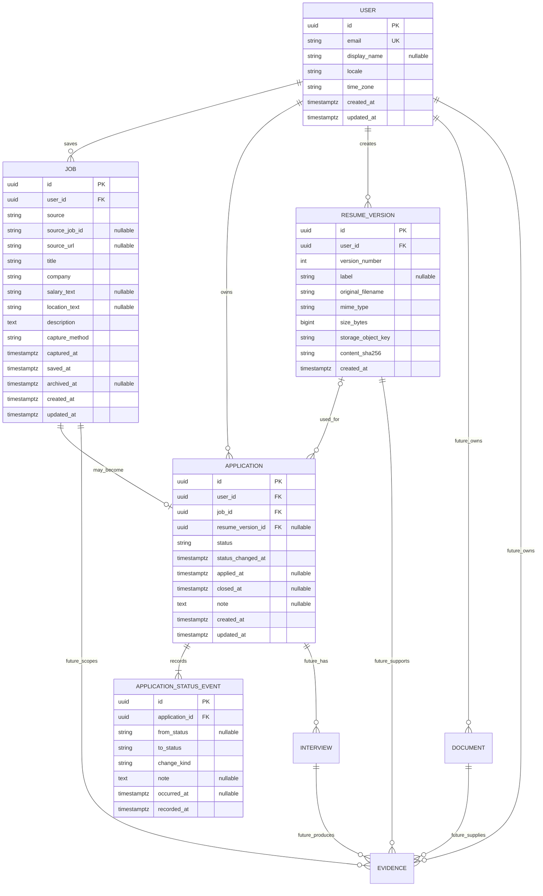
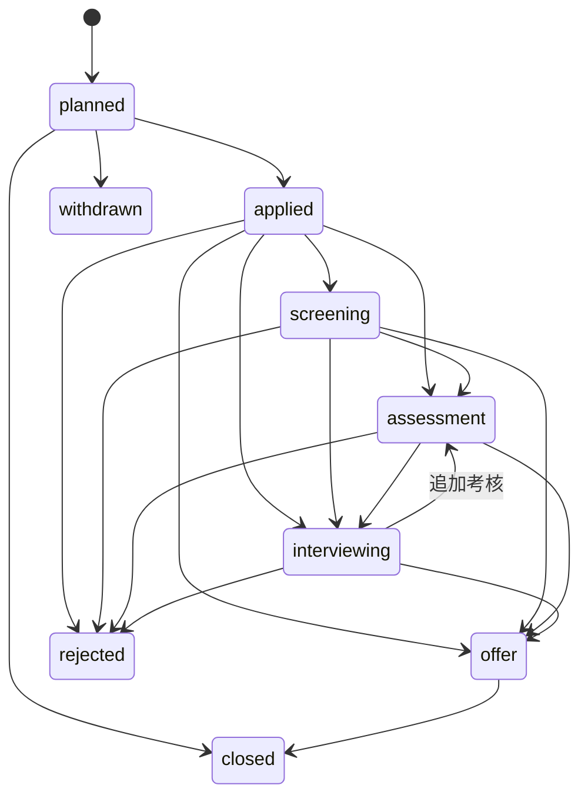

# JobPilot MVP 核心数据模型（Phase 1–4）

> 文档状态：Phase 0 概念/逻辑模型（不是 SQL DDL，也不代表数据库已经实现）  
> 展开范围：`User`、`Job`、`Application`、`ResumeVersion` 四个核心实体，以及 `Application` 内部的最小状态事件子记录  
> 仅预留：`Interview`、`Document`、`Evidence`

## 1. 建模原则

- PostgreSQL 是持久业务事实来源；Web 与 Extension 不独立定义或保存另一套业务状态。
- 所有用户资源均有明确所有者，服务端从认证上下文执行授权，不能信任客户端提交的 `userId`。
- Job 是某个用户主动保存的岗位快照，不是 JobPilot 建立的公共招聘职位库。
- Application 表达投递工作流；单纯收藏岗位不创建 Application。
- ResumeVersion 是不可变版本，Application 引用当时实际使用的版本，不能随“当前简历”漂移。
- API DTO 与持久化模型分离；数据库字段、对象存储 key 和内部审计字段不原样暴露。
- 时间统一保存为带时区的 UTC 时间，展示时使用 User 的时区。
- 字段命名在数据库使用 `snake_case`，API wire format 使用 `camelCase`。
- Phase 0 不展开认证凭证、AI 分析结果、向量 chunk 或文件处理表；状态历史只保留 Application 所需的最小追加式子记录，不形成独立业务资源。

## 2. 关系总览



`ApplicationStatusEvent` 是 Application 的内部追加式子记录，不是第五个顶级业务资源。它只通过 Application 下的分页只读子资源查看，没有顶级资源或直接写入 endpoint。图中的 `Interview`、`Document`、`Evidence` 只用于表达未来关系方向，不在 Phase 0 定义字段、表或实现。未来迁移必须先更新本文件并形成相应 ADR。

## 3. User

### 职责

代表 JobPilot 的资源所有者和个性化设置主体。认证凭证是否由本地认证或外部身份提供者管理，留给认证专项规格；凭证不混入本概念模型。

### 核心字段

| 字段 | 必需 | 语义与约束 |
| --- | --- | --- |
| `id` | 是 | 服务端生成的稳定 UUID；公开标识不承载业务含义 |
| `email` | 是 | 登录/联系标识；写入前规范化；唯一；API 默认不向其他用户展示 |
| `display_name` | 否 | 用户可修改的显示名称，不作为唯一标识 |
| `locale` | 是 | 文案和 AI 输出语言偏好，例如 `zh-CN` |
| `time_zone` | 是 | IANA 时区，例如 `Asia/Shanghai` |
| `created_at` | 是 | 创建时间 |
| `updated_at` | 是 | 最近一次可变资料更新时间 |

### 约束

- 账号删除、导出和数据保留策略必须在 Phase 2 形成数据生命周期规格；其中与简历、对象存储有关的删除责任最迟在 Phase 4 上传启用前实现并测试。
- 其他核心实体必须通过 `user_id` 隔离；API 不允许跨用户引用 Job 或 ResumeVersion。

## 4. Job

### 职责

代表用户主动确认并保存的某一时刻岗位快照。Job 保留来源信息以便回访，但 JobPilot 不依赖来源页面持续存在，也不会后台刷新该页面。

### 核心字段

| 字段 | 必需 | 语义与约束 |
| --- | --- | --- |
| `id` | 是 | 服务端生成 UUID |
| `user_id` | 是 | 所有者；所有查询和写入的授权边界 |
| `source` | 是 | `boss`、`nowcoder`、`shixiseng`、`liepin`、`iguopin`、`generic` 或 `manual` |
| `source_job_id` | 否 | 页面明确提供时保存的平台岗位 ID；不得调用隐藏接口获取 |
| `source_url` | 条件必需 | 自动/选区采集时为当前页面 URL；纯手动粘贴允许为空；写入前移除已知跟踪参数并规范化 |
| `title` | 是 | 用户确认后的岗位名称 |
| `company` | 是 | 用户确认后的公司名称 |
| `salary_text` | 否 | 保留来源展示文本；早期不强行推断统一薪资数值 |
| `location_text` | 否 | 保留来源展示文本；早期不强行推断行政区代码 |
| `description` | 是 | 用户确认后的 JD 正文；服务端校验长度并安全呈现 |
| `capture_method` | 是 | `automatic`、`selection` 或 `manual` |
| `captured_at` | 是 | 客户端发生采集的时间；只作来源元数据，不替代服务端时间 |
| `saved_at` | 是 | API 成功持久化的服务端时间，即“已收藏”事实 |
| `archived_at` | 否 | 用户将收藏归档的时间；归档不等于投递关闭 |
| `created_at` | 是 | 记录创建时间，通常与 `saved_at` 相同 |
| `updated_at` | 是 | 用户修正快照字段或归档状态的时间 |

### 收藏与去重

`saved` 不属于 Application 状态。原因是收藏岗位时用户可能完全没有投递计划；如果为收藏强制创建 Application，会制造虚假投递漏斗并混淆转化统计。

收藏事实用以下方式表达：

- 存在一条用户所有的 Job 且有 `saved_at`：已收藏。
- 没有对应 Application：仅收藏，尚未进入投递工作流。
- `archived_at` 非空：该收藏已归档，但不推断申请结果。

去重只在单个用户范围内进行。优先键是 `(user_id, source, source_job_id)`；没有稳定平台 ID 时使用规范化 URL 形成内部 `dedupe_key`。纯手动内容没有可靠来源键时，API提示可能重复而不做跨用户内容合并。`dedupe_key` 是实现细节，可在数据库迁移规格中补充，不进入公开 DTO。

### 隐私边界

默认不持久化完整页面 DOM、Cookie、平台 Token 或与岗位无关的页面内容。Job 是用户私有快照，不作为其他用户的共享岗位记录。

## 5. Application

### 职责

代表用户针对一个已保存 Job 的一次投递工作流。第一阶段每个 `(user_id, job_id)` 至多一条 Application；未来若出现真实“同岗位多次投递”需求，再通过 ADR 引入 attempt 概念，而不是现在预建复杂模型。

### 核心字段

| 字段 | 必需 | 语义与约束 |
| --- | --- | --- |
| `id` | 是 | 服务端生成 UUID |
| `user_id` | 是 | 所有者；必须与关联 Job、ResumeVersion 的所有者一致 |
| `job_id` | 是 | 被跟踪的 Job；第一阶段与 `user_id` 组成唯一业务约束 |
| `resume_version_id` | 否 | 实际投递使用的固定 ResumeVersion；尚未选择或未知时允许为空；离开 `planned` 后按下文规则锁定 |
| `status` | 是 | 统一的 `ApplicationStatus`，只能取下文九个值 |
| `status_changed_at` | 是 | 当前状态最近一次写入的服务端时间，等于最后一条事件的 `recorded_at`；不冒充现实流程发生时间 |
| `applied_at` | 否 | 用户实际提交投递的时间；进入/越过 `applied` 后可补录一次，未知时不猜测；普通更新不能覆盖或清空已知值 |
| `closed_at` | 否 | 进入 `closed` 时记录的关闭时间；纠正离开 `closed` 时清空；其他结果状态不自动等价为 closed |
| `note` | 否 | 用户的简短工作流备注；不是面试记录或文档仓库 |
| `created_at` | 是 | 工作流创建时间 |
| `updated_at` | 是 | 最近更新时间 |

### ApplicationStatusEvent（内部子记录）

Application 创建时写入首条事件；之后只有状态真实变化时才追加事件。它用于保留 MVP 阶段无法事后重建的流程事实，并为后续阶段耗时和漏斗统计提供来源，但不作为可独立增删改查的业务资源。

| 字段 | 必需 | 语义与约束 |
| --- | --- | --- |
| `id` | 是 | 内部稳定 UUID；不进入公共 `ApplicationStatusEventView` |
| `application_id` | 是 | 所属 Application；授权始终通过 Application 的所有者判断 |
| `from_status` | 否 | 创建事件为 `null`，其余事件为变更前状态 |
| `to_status` | 是 | 变更后的合法 `ApplicationStatus` |
| `change_kind` | 是 | `progress` 表示真实流程进展；`correction` 表示用户修正误录 |
| `note` | 否 | 本次变更的简短说明；correction 必填 |
| `occurred_at` | 否 | 用户明确提供的现实流程发生时间；未知时保持为空，不由系统猜测 |
| `recorded_at` | 是 | 服务端不可伪造的录入时间；用于稳定排序与审计 |

`Application.status`、`status_changed_at` 与新增事件必须在同一事务中更新；当前字段是列表查询所需的权威快照，事件是不可原地修改的历史事实。同值更新是 no-op，不追加事件。阶段耗时优先使用相邻事件的 `occurred_at`；任一端缺失时，只能明确标注为基于系统 `recorded_at` 的近似统计。

### ResumeVersion 关联锁定

- Application 处于 `planned` 时，用户可以设置、替换或清空 `resume_version_id`。
- Application 离开 `planned` 后，如果关联仍为空，可补录一次实际使用版本；一旦非空，普通更新不得替换或清空。
- 同一请求从 `planned` 进入后续状态时，可以同时绑定实际使用版本。
- 未来如确有纠错需求，必须先定义显式、带原因且可审计的纠错用例；不得用普通 PATCH 静默改写历史事实。
- `applied_at` 同样是历史事实：`planned` 状态不得填写；进入或越过 `applied` 后允许从空值补录一次，已知值的纠错必须走未来的显式审计用例。

### ApplicationStatus 统一定义

唯一允许值为：

```text
planned
applied
screening
assessment
interviewing
offer
rejected
withdrawn
closed
```

| 状态 | 含义 |
| --- | --- |
| `planned` | 用户明确计划投递，但尚未确认已提交 |
| `applied` | 用户已通过招聘平台或其他渠道正式提交 |
| `screening` | 简历筛选、招聘方初筛或电话初筛阶段 |
| `assessment` | 笔试、在线测评、作业、案例或其他非面试考核；取代过窄的 `written_test` |
| `interviewing` | 一轮或多轮正式面试进行中；轮次由未来 Interview 表达，不扩张状态枚举 |
| `offer` | 已收到 offer；是否接受可在后续需求明确后建模，当前不猜测 |
| `rejected` | 招聘方明确拒绝或流程明确失败 |
| `withdrawn` | 用户主动退出该投递 |
| `closed` | 用户明确结束/归档该工作流，例如岗位关闭、长期无响应或无需继续跟进；不代表成功或失败 |

`saved` 被排除，因为它描述 Job 收藏事实而非投递进度。`assessment` 替代 `written_test`，可以覆盖国内平台常见的笔试，也能容纳测评、作业和案例环节而无需继续增加状态。

### 状态流转原则



该图是正常流程指引，不是僵硬的数据库有限状态机。真实招聘流程可能跳过阶段、倒序补录或需要纠错，因此：

- API 强制枚举、资源所有权和时间字段一致性。
- 正常 UI 引导推荐流转，但允许用户显式纠正状态，并更新 `status_changed_at`。
- 任意非终止状态均可由用户转为 `withdrawn` 或 `closed`；图中省略重复箭头以保持可读。
- 每次真实状态变化都在同一事务中追加最小 `ApplicationStatusEvent`；不把历史塞进 Application 的 JSON 数组，也不假装 `updated_at` 是完整历史。
- `rejected`、`withdrawn`、`closed` 是终止状态；误录只能通过带说明的 `correction` 纠正，而不是伪装成正常流程进展。
- 进入 `closed` 时，`closed_at` 使用明确提供的 `occurred_at`；未提供时使用本次服务端 `recorded_at`。通过 correction 离开 `closed` 时必须清空 `closed_at`。

权威状态由 PostgreSQL 持久化、由 API 领域规则变更。Web/Extension 只能消费同一 wire contract；任何客户端不允许另起一个不同枚举。

## 6. ResumeVersion

### 职责

代表某份简历的不可变版本及其私有原始文件引用。编辑或重新上传会创建新版本，已关联 Application 始终指向当时版本，以保证匹配分析和复盘可重现。

### 核心字段

| 字段 | 必需 | 语义与约束 |
| --- | --- | --- |
| `id` | 是 | 服务端生成 UUID |
| `user_id` | 是 | 所有者；对象读取和 Application 引用均受此边界约束 |
| `version_number` | 是 | 用户范围内单调递增，与 `user_id` 组成唯一约束 |
| `label` | 否 | 用户可读标签，例如“产品经理-数据方向” |
| `original_filename` | 是 | 展示和下载用文件名；不能作为对象 key |
| `mime_type` | 是 | 经服务端校验的允许类型，不仅信任客户端声明 |
| `size_bytes` | 是 | 用于上传限制与完整性检查 |
| `storage_object_key` | 是 | `ObjectStore` 返回的不透明私有 key；不进入普通 API DTO |
| `content_sha256` | 是 | 完整性和重复上传判断，不作为跨用户共享依据 |
| `created_at` | 是 | 该版本创建时间；版本内容创建后不可覆盖 |

### 约束

- 原始二进制不存 PostgreSQL；通过 `ObjectStore` port 保存。
- 不提供永久公开 URL。下载请求先经 API 授权，再流式返回或签发短时效 URL。
- `storage_object_key` 指向的对象不可原地覆盖；新内容必须创建新 ResumeVersion。
- 被 Application 引用的版本不能在未定义保留策略前硬删除。
- “当前默认简历”的选择规则不在本表提前建模。Phase 6 在实现 ResumeMatcher 前定义与 ResumeVersion 绑定的版本化文本提取和处理状态；RAG chunk/embedding 仍留到 Phase 7 的 Document 规格。

## 7. 未来关系预留（不展开）

### Interview

- 未来从属于 Application，一次 Application 可以有零到多次 Interview。
- 面试轮次、真实问题、用户回答摘要、评价和录音/转写的具体结构在面试准备/真实复盘或模拟面试 Phase 再定义。
- Application 的 `interviewing` 不编码轮次，避免状态枚举爆炸。

### Document

- 未来从属于 User，表示用户主动上传或确认进入知识库的资料元数据。
- 原始内容走对象存储；检索 chunk/embedding 走 PostgreSQL + pgvector。
- ResumeVersion 是否以特殊 Document 复用，需要在 RAG Phase 基于删除、权限和版本需求再决策；当前不强制合表或继承。

### Evidence

- 未来从属于 User，并在特定 Job/岗位要求语境下连接 ResumeVersion、Document 或 Interview 中的可追溯证据。
- 目标链路为 `Requirement → Evidence → Resume/Portfolio → Interview`，但 Phase 0 不定义评分算法、几十种证据类型或图数据库。
- AI 可以提出候选证据，成为持久可信映射前必须经过 schema 校验，并在需要时由用户确认。

## 8. 完整性与索引候选

以下仅是进入数据库实现 Phase 时必须验证的候选，不是本轮建表：

- 所有外键都验证同一 `user_id` 所有权；不能仅靠 UI 隐藏越权资源。
- `User.email` 规范化后唯一。
- `Application(user_id, job_id)` 第一阶段唯一。
- `ApplicationStatusEvent(application_id, recorded_at, id)` 提供稳定历史顺序；事件不能绕过所属 Application 单独访问。
- `ResumeVersion(user_id, version_number)` 唯一。
- Job 的用户内来源去重键唯一或采用明确的冲突确认策略；手动岗位不做脆弱的全文强唯一。
- 常用列表至少评估 `(user_id, saved_at)`、`(user_id, status, updated_at)` 和 `(user_id, created_at)` 索引。
- API 删除行为优先使用明确归档/保留语义；涉及个人数据彻底删除时必须同时协调 PostgreSQL、对象存储和未来向量数据。

## 9. 尚待后续规格决定

- 认证提供者、账号合并与用户删除/导出保留期。
- Application 状态事件的长期保留和未来系统自动变更 actor 语义，在出现相应需求时再扩展；Phase 4 只记录用户触发的最小历史，并分别保留可空现实发生时间与可靠录入时间。
- offer 接受/拒绝是否需要独立结果字段，必须以真实产品需求而不是枚举“全面性”驱动。
- 简历允许的格式、大小、病毒检查、解析失败和重新处理策略。
- 平台 URL 规范化与重复岗位冲突的精确规则，需要使用真实 fixture 验证。
- Document、Evidence、Interview 的字段和删除级联规则留到对应 Phase，不在 Phase 0 预建。
